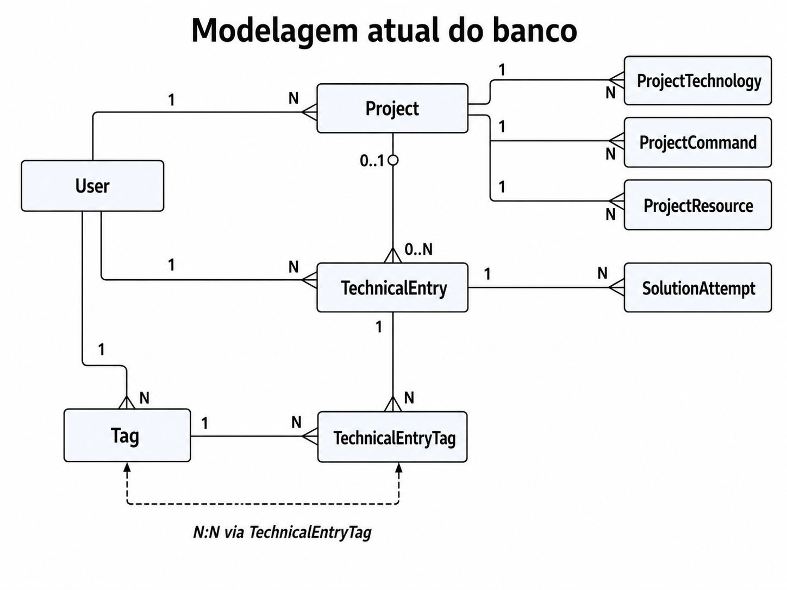

Pelo contexto, o banco deve manter o **registro técnico como núcleo**, com projetos apenas como contexto opcional. Tags representam assuntos ou tecnologias, não projetos.

## 1. Modelo lógico

### Entidades principais



### Cardinalidades

| Relacionamento                   | Cardinalidade | Explicação                                                                     |
| -------------------------------- | ------------: | ------------------------------------------------------------------------------ |
| User → Project                   |           1:N | Um usuário pode possuir vários projetos                                        |
| User → TechnicalEntry            |           1:N | Um usuário pode criar vários registros                                         |
| User → Tag                       |           1:N | Cada usuário possui seu próprio conjunto de tags                               |
| Project → TechnicalEntry         |  1:N opcional | Um projeto pode possuir vários registros, mas um registro pode não ter projeto |
| TechnicalEntry → SolutionAttempt |           1:N | Um problema pode ter várias tentativas                                         |
| TechnicalEntry ↔ Tag             |           N:N | Um registro pode ter várias tags e uma tag pode estar em vários registros      |
| Project → ProjectTechnology      |           1:N | Um projeto pode usar várias tecnologias                                        |
| Project → ProjectCommand         |           1:N | Um projeto pode possuir vários comandos                                        |
| Project → ProjectResource        |           1:N | Um projeto pode possuir vários links e recursos                                |

A relação entre registro e projeto é opcional, porém cada registro pode estar vinculado a no máximo um projeto no MVP.

---

# 2. Modelo relacional

## `users`

```text
users
-----
id                UUID PK
name              VARCHAR(120) NOT NULL
email             VARCHAR(255) NOT NULL UNIQUE
password_hash     VARCHAR(255) NOT NULL
created_at        TIMESTAMPTZ NOT NULL
updated_at        TIMESTAMPTZ NOT NULL
```

### Observações

- O e-mail deve ser único globalmente.
- A senha nunca deve ser salva diretamente.
- O nome `password_hash` deixa mais claro que o campo contém um hash.

### Geração de identificadores e timestamps

As entidades de domínio geram o UUID na aplicação quando são criadas sem `id` e os repositórios persistem esse mesmo valor.

No Prisma 7.9 usado pelo projeto, `@default(uuid())` gera o UUID no Prisma Client, mas não produz um `DEFAULT` na coluna PostgreSQL. Para garantir a proteção complementar também em inserções diretas no banco, o schema declara:

```prisma
@default(dbgenerated("gen_random_uuid()"))
```

Assim, o UUID recebido da aplicação é preservado e o PostgreSQL usa `gen_random_uuid()` apenas quando a inserção não fornece um `id`.

Os timestamps seguem o padrão:

```text
id         @default(dbgenerated("gen_random_uuid()"))
created_at @default(now())
updated_at @updatedAt
```

No PostgreSQL, os IDs usam o tipo nativo `UUID` e os timestamps usam `TIMESTAMPTZ`.

---

## `projects`

```text
projects
--------
id                UUID PK
user_id           UUID NOT NULL FK -> users.id
name              VARCHAR(150) NOT NULL
description       TEXT NULL
status            project_status NOT NULL DEFAULT ACTIVE
local_path        TEXT NULL
created_at        TIMESTAMPTZ NOT NULL
updated_at        TIMESTAMPTZ NOT NULL
archived_at       TIMESTAMPTZ NULL
```

### Enum

```text
project_status
--------------
ACTIVE
PAUSED
FINISHED
```

O arquivamento deve ser controlado por `archived_at`, não por um valor `ARCHIVED` dentro de `status`.

Isso evita misturar dois conceitos:

- `status`: estado funcional do projeto;
- `archived_at`: visibilidade e arquivamento do registro.

Novos projetos começam com o status `ACTIVE` por padrão.

### Restrição de unicidade

```text
UNIQUE (user_id, name)
```

Um usuário não pode ter dois projetos com o mesmo nome, mas usuários diferentes podem ter projetos com nomes iguais.

### Sobre `repository_url`

O documento inicialmente coloca `repositoryUrl` diretamente em `Project`, mas também define `ProjectResource` com o tipo `REPOSITORY`.

Foi decidido **remover `repository_url` de `projects`** e armazenar repositórios em `project_resources`, porque:

- um projeto pode possuir frontend e backend em repositórios separados;
- pode existir mais de um repositório;
- `ProjectResource` já representa esse conceito.

---

## `technical_entries`

```text
technical_entries
-----------------
id                UUID PK
user_id           UUID NOT NULL FK -> users.id
project_id        UUID NULL FK -> projects.id
title             VARCHAR(200) NOT NULL
type              technical_entry_type NOT NULL
context           TEXT NOT NULL
conclusion        TEXT NULL
resolved_at       TIMESTAMPTZ NULL
created_at        TIMESTAMPTZ NOT NULL
updated_at        TIMESTAMPTZ NOT NULL
archived_at       TIMESTAMPTZ NULL
```

### Tipo

```text
technical_entry_type
--------------------
ISSUE
LEARNING
```

Os tipos iniciais definidos são `ISSUE` e `LEARNING`, e apenas registros do tipo `ISSUE` podem possuir tentativas.

### Resolução de problemas

Um registro `LEARNING` não é exatamente “aberto” ou “resolvido”.

Foi escolhida a substituição de `status` por:

```text
resolved_at TIMESTAMPTZ NULL
```

Nesse modelo:

- `ISSUE` com `resolved_at IS NULL`: aberto;
- `ISSUE` com `resolved_at IS NOT NULL`: resolvido;
- `LEARNING`: `resolved_at` sempre nulo.

A tabela ficaria:

```text
technical_entries
-----------------
id
user_id
project_id
title
type
context
conclusion
resolved_at
created_at
updated_at
archived_at
```

Essa decisão reduz estados inválidos, como:

```text
type = LEARNING
status = RESOLVED
```

### Regras de negócio

```text
type != ISSUE -> resolved_at deve ser NULL
resolved_at != NULL -> conclusion deve estar preenchida
```

Essas regras serão validadas na aplicação, sem `CHECK constraint` ou trigger no banco.

---

## `solution_attempts`

```text
solution_attempts
-----------------
id                  UUID PK
technical_entry_id  UUID NOT NULL FK -> technical_entries.id
description         TEXT NOT NULL
result              solution_attempt_result NOT NULL
created_at          TIMESTAMPTZ NOT NULL
updated_at          TIMESTAMPTZ NOT NULL
```

### Enum

```text
solution_attempt_result
-----------------------
FAILED
PARTIAL
SUCCESSFUL
```

### Relacionamento

```text
technical_entries 1 ---- N solution_attempts
```

### Regra importante

Somente registros `ISSUE` podem possuir tentativas.

Essa regra não pode ser garantida facilmente por uma `CHECK`, porque ela depende de consultar outra tabela. Deve ser garantida por:

1. regra no domínio/caso de uso;
2. teste de integração.

A regra já está explicitamente definida no projeto.

### Exclusão

```text
ON DELETE CASCADE
```

Ao remover definitivamente um registro técnico, suas tentativas também devem ser removidas.

No uso normal, porém, registros devem ser arquivados em vez de apagados.

---

## `tags`

```text
tags
----
id                UUID PK
user_id           UUID NOT NULL FK -> users.id
name              VARCHAR(80) NOT NULL
normalized_name   VARCHAR(80) NOT NULL
created_at        TIMESTAMPTZ NOT NULL
updated_at        TIMESTAMPTZ NOT NULL
```

### Restrição

```text
UNIQUE (user_id, normalized_name)
```

O campo `normalized_name` pode armazenar:

```text
"NestJS"          -> "nestjs"
"Banco de Dados"  -> "banco de dados"
" Docker "        -> "docker"
```

Assim, o mesmo usuário não consegue criar:

```text
Docker
docker
DOCKER
```

como três tags diferentes.

Cada usuário só pode usar suas próprias tags.

---

## `technical_entry_tags`

Tabela associativa para o relacionamento N:N.

```text
technical_entry_tags
--------------------
technical_entry_id  UUID NOT NULL FK -> technical_entries.id
tag_id              UUID NOT NULL FK -> tags.id
created_at          TIMESTAMPTZ NOT NULL

PK (technical_entry_id, tag_id)
```

### Por que chave primária composta?

Porque o par já identifica unicamente a associação:

```text
technical_entry_id + tag_id
```

Um campo `id` adicional não traria benefício no MVP.

### Exclusão

```text
technical_entry_id ON DELETE CASCADE
tag_id             ON DELETE CASCADE
```

Ao excluir uma tag ou um registro, suas associações desaparecem.

---

## `project_technologies`

```text
project_technologies
--------------------
id                UUID PK
project_id        UUID NOT NULL FK -> projects.id
name              VARCHAR(100) NOT NULL
version           VARCHAR(50) NULL
created_at        TIMESTAMPTZ NOT NULL
updated_at        TIMESTAMPTZ NOT NULL
```

### Restrição

```text
UNIQUE (project_id, name)
```

Uma tecnologia é única por nome dentro do projeto. Com essa restrição, não é possível registrar:

```text
Node.js 20
Node.js 22
```

no mesmo projeto. Essa limitação foi aceita para o MVP.

As tecnologias são informações específicas de um único projeto.

---

## `project_commands`

```text
project_commands
----------------
id                UUID PK
project_id        UUID NOT NULL FK -> projects.id
title             VARCHAR(120) NOT NULL
command           TEXT NOT NULL
description       TEXT NULL
execution_order   INTEGER NULL
created_at        TIMESTAMPTZ NOT NULL
updated_at        TIMESTAMPTZ NOT NULL
```

### Regra de negócio

```text
execution_order deve ser NULL ou maior ou igual a zero
```

Essa regra será validada pela aplicação, sem `CHECK constraint` no banco. `execution_order` não é único por projeto, portanto dois comandos podem ocupar a mesma posição.

Os comandos devem ser apenas documentados; o sistema não deve executá-los no navegador.

---

## `project_resources`

```text
project_resources
-----------------
id                UUID PK
project_id        UUID NOT NULL FK -> projects.id
label             VARCHAR(120) NOT NULL
url               TEXT NOT NULL
type              project_resource_type NOT NULL
created_at        TIMESTAMPTZ NOT NULL
updated_at        TIMESTAMPTZ NOT NULL
```

### Enum

```text
project_resource_type
---------------------
REPOSITORY
DOCUMENTATION
LOCAL_URL
EXTERNAL_URL
OTHER
```

### Restrição

```text
UNIQUE (project_id, url)
```

Essa restrição impede cadastrar a mesma URL várias vezes no mesmo projeto.

---

# 3. Política de exclusão

As relações usam os seguintes comportamentos:

| Relação | Comportamento |
| --- | --- |
| `User` → `Project` | `ON DELETE CASCADE` |
| `User` → `TechnicalEntry` | `ON DELETE CASCADE` |
| `User` → `Tag` | `ON DELETE CASCADE` |
| `Project` → `TechnicalEntry` | `ON DELETE SET NULL` |
| `Project` → `ProjectTechnology` | `ON DELETE CASCADE` |
| `Project` → `ProjectCommand` | `ON DELETE CASCADE` |
| `Project` → `ProjectResource` | `ON DELETE CASCADE` |
| `TechnicalEntry` → `SolutionAttempt` | `ON DELETE CASCADE` |
| `TechnicalEntry`/`Tag` → `TechnicalEntryTag` | `ON DELETE CASCADE` |

Excluir diretamente um projeto apaga suas tecnologias, comandos e recursos. Os registros técnicos associados são preservados e passam a ter `project_id = NULL`.

A exclusão de um usuário também se propaga para seus projetos, registros e tags. Ao excluir os projetos, o banco remove em cascata suas tecnologias, comandos e recursos.

No fluxo normal, projetos e registros técnicos são arquivados em vez de excluídos definitivamente.

---

# 4. Diagrama relacional completo

```text
USERS
- id PK
- name
- email UK
- password_hash
- created_at
- updated_at

PROJECTS
- id PK
- user_id FK -> USERS.id
- name
- description
- status
- local_path
- created_at
- updated_at
- archived_at
- UK (user_id, name)

TECHNICAL_ENTRIES
- id PK
- user_id FK -> USERS.id
- project_id FK -> PROJECTS.id NULL
- title
- type
- context
- conclusion
- resolved_at
- created_at
- updated_at
- archived_at

SOLUTION_ATTEMPTS
- id PK
- technical_entry_id FK -> TECHNICAL_ENTRIES.id
- description
- result
- created_at
- updated_at

TAGS
- id PK
- user_id FK -> USERS.id
- name
- normalized_name
- created_at
- updated_at
- UK (user_id, normalized_name)

TECHNICAL_ENTRY_TAGS
- technical_entry_id PK FK -> TECHNICAL_ENTRIES.id
- tag_id PK FK -> TAGS.id
- created_at

PROJECT_TECHNOLOGIES
- id PK
- project_id FK -> PROJECTS.id
- name
- version
- created_at
- updated_at
- UK (project_id, name)

PROJECT_COMMANDS
- id PK
- project_id FK -> PROJECTS.id
- title
- command
- description
- execution_order
- created_at
- updated_at

PROJECT_RESOURCES
- id PK
- project_id FK -> PROJECTS.id
- label
- url
- type
- created_at
- updated_at
- UK (project_id, url)
```

---

# 5. Restrições entre usuários

Existe um ponto importante: somente colocar `user_id` nas tabelas não garante integralmente estas regras:

- o registro deve pertencer ao mesmo usuário do projeto;
- a tag deve pertencer ao mesmo usuário do registro;
- o usuário não pode acessar dados de outro usuário.

Essas são regras declaradas no documento.

Por exemplo, sem validação adicional seria tecnicamente possível salvar:

```text
technical_entry.user_id = usuário A
technical_entry.project_id = projeto do usuário B
```

## Decisão para o MVP

Validar isso nos casos de uso:

```text
CreateTechnicalEntry
UpdateTechnicalEntry
AddTagToEntry
```

Antes de relacionar:

```text
project.userId === currentUser.id
tag.userId === currentUser.id
entry.userId === currentUser.id
```

## Alternativa não adotada

Usar chaves estrangeiras compostas.

Em `projects`:

```text
UNIQUE (id, user_id)
```

Em `technical_entries`:

```text
FOREIGN KEY (project_id, user_id)
REFERENCES projects (id, user_id)
```

Para tags, a tabela associativa teria também o `user_id`:

```text
technical_entry_tags
--------------------
technical_entry_id
tag_id
user_id
```

E usaria FKs compostas.

Isso aumenta a segurança estrutural, mas também aumenta a complexidade do Prisma e das consultas. Foi decidido manter essas validações na aplicação e cobri-las com testes de integração.

---

# 6. Índices

```sql
CREATE INDEX idx_projects_user
ON projects (user_id);

CREATE INDEX idx_projects_active
ON projects (user_id, archived_at);

CREATE INDEX idx_entries_user_created
ON technical_entries (user_id, created_at DESC);

CREATE INDEX idx_entries_active_created
ON technical_entries (user_id, archived_at, created_at DESC);

CREATE INDEX idx_entries_project
ON technical_entries (project_id);

CREATE INDEX idx_entries_type
ON technical_entries (user_id, type);

CREATE INDEX idx_entries_resolved
ON technical_entries (user_id, resolved_at);

CREATE INDEX idx_attempts_entry
ON solution_attempts (technical_entry_id, created_at);

CREATE INDEX idx_entry_tags_tag
ON technical_entry_tags (tag_id);

CREATE INDEX idx_technologies_project
ON project_technologies (project_id);

CREATE INDEX idx_commands_project_order
ON project_commands (project_id, execution_order);

CREATE INDEX idx_resources_project
ON project_resources (project_id);
```

O MVP usa o parâmetro `title` para fazer correspondência parcial case-insensitive somente no título. Se futuramente a busca também abranger contexto e conclusão, vale considerar `tsvector` e índice GIN do PostgreSQL:

```sql
CREATE INDEX idx_entries_full_text
ON technical_entries
USING GIN (
    to_tsvector(
        'portuguese',
        coalesce(title, '') || ' ' ||
        coalesce(context, '') || ' ' ||
        coalesce(conclusion, '')
    )
);
```

No MVP, o filtro textual é feito por título. Projeto, tag, tipo e status permanecem filtros estruturados separados.

---

# 7. Decisões consolidadas

As decisões consolidadas para o schema são:

1. **Remover `repositoryUrl` de `Project`** e usar apenas `ProjectResource`.
2. **Trocar o `status` do registro por `resolvedAt`**, porque `LEARNING` não possui estado aberto ou resolvido.
3. **Adicionar timestamps às entidades secundárias**, principalmente tags, tecnologias, comandos e recursos.
4. **Adicionar nome normalizado às tags**, evitando duplicidades por letras maiúsculas ou espaços.
5. **Não colocar ambientes e serviços agora**, porque estão corretamente classificados como evolução futura, e não como parte do núcleo do MVP.
6. **Não criar tabela de tecnologias global neste momento**. Uma tecnologia pertence ao contexto de um projeto no escopo atual; normalizá-la globalmente adicionaria complexidade sem benefício claro.
7. **Gerar UUIDs normalmente no domínio** e manter `gen_random_uuid()` como fallback no PostgreSQL.
8. **Tornar o nome do projeto único por usuário**, a tecnologia única por nome dentro do projeto e a URL de recurso única dentro do projeto.
9. **Permitir ordens de execução repetidas** nos comandos de um mesmo projeto.
10. **Validar regras entre usuários e demais invariantes na aplicação**, sem chaves estrangeiras compostas, triggers ou `CHECK constraints`.
11. **Preservar registros ao excluir um projeto**, definindo `project_id` como `NULL`, e remover em cascata as tecnologias, os comandos e os recursos do projeto.
12. **Iniciar novos projetos com status `ACTIVE`** por padrão.
13. **Otimizar a listagem de registros não arquivados** com um índice em `(user_id, archived_at, created_at DESC)`, cobrindo filtro e ordenação.

Esse modelo resulta em **nove tabelas**, incluindo a tabela associativa `technical_entry_tags`, mantém o MVP pequeno e suporta as funcionalidades previstas sem antecipar estruturas de infraestrutura que ainda não fazem parte do produto.
