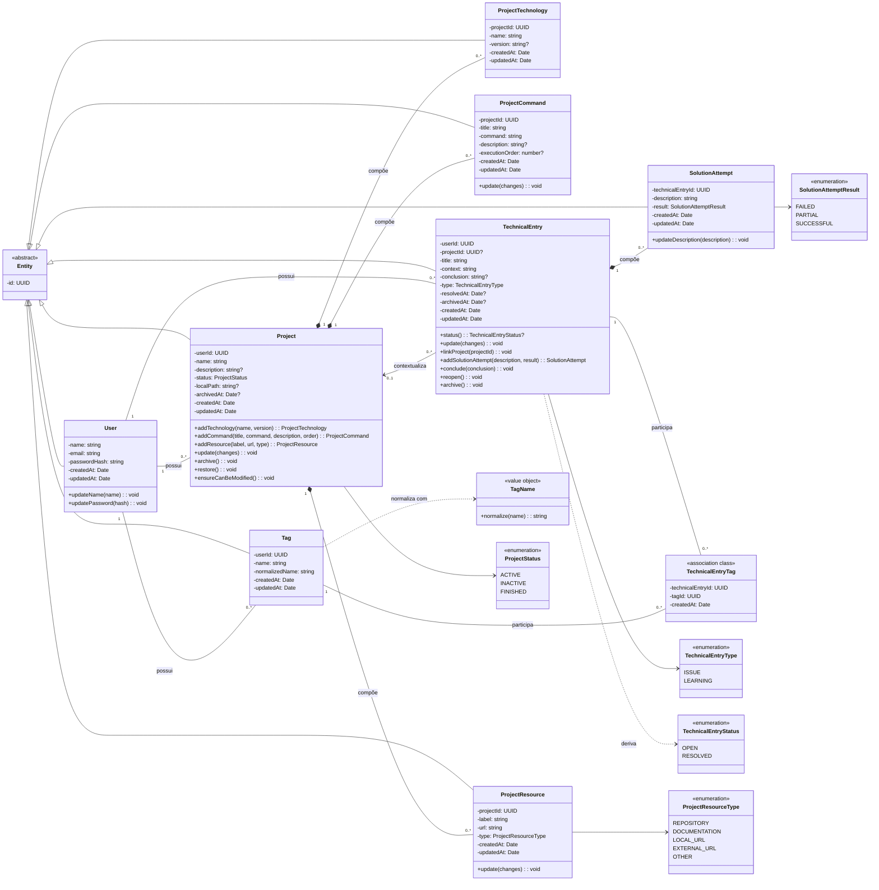
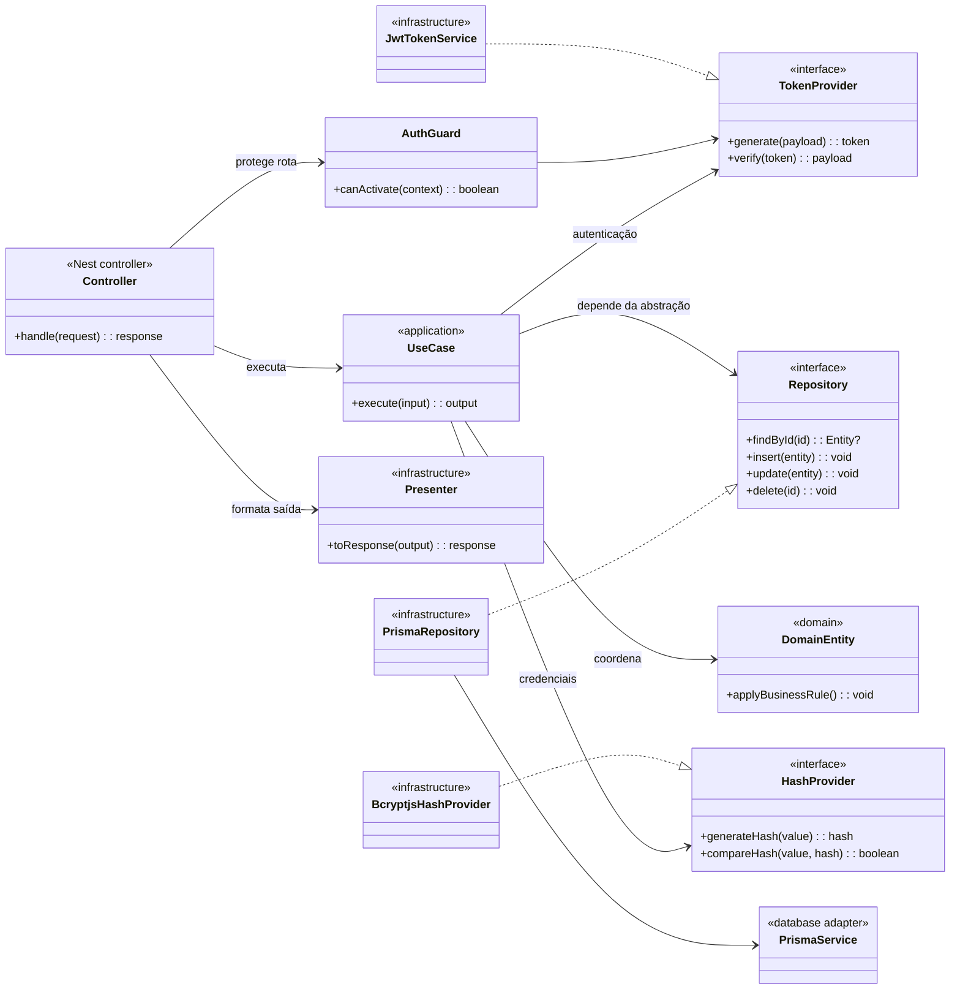

# Diagramas de classes

## Modelo de domínio

Este é o diagrama principal para estudo de UML. Ele prioriza conceitos do
negócio e omite getters, setters, DTOs, presenters e detalhes do ORM. Atributos
com `?` são opcionais; atributos seguidos de `/` são derivados.

### Leitura dos relacionamentos

- `Project` compõe tecnologia, comando e recurso porque esses objetos são
  criados dentro de um projeto, não fazem sentido sem ele e são excluídos em
  cascata.
- `TechnicalEntry` compõe `SolutionAttempt` pela mesma relação de ciclo de vida.
- `TechnicalEntry` apenas se associa a `Project`: o vínculo é opcional e, ao
  excluir o projeto, a entrada sobrevive com `projectId` vazio.
- `TechnicalEntryTag` materializa a associação muitos-para-muitos e guarda a
  data da atribuição. O Mermaid não possui notação nativa de “association
  class”, então o estereótipo explicita seu papel.
- `User` aparece com associações de propriedade, não como composição do modelo
  de domínio. Embora o banco use cascata ao excluir usuário, esses objetos são
  agregados manipulados por casos de uso e repositórios próprios.

## Visão técnica das camadas

Este segundo diagrama não substitui o modelo de domínio. Ele mostra o padrão
arquitetural repetido nos módulos NestJS e explica por que controller, caso de
uso e repositório não aparecem como classes de negócio acima.

O princípio central é **inversão de dependência**: a aplicação conhece
contratos de repositório e provedores; as implementações Prisma, JWT e bcrypt
ficam na infraestrutura. Isso permite testar casos de uso com doubles sem
carregar banco ou servidor HTTP.

## Mapeamento de estado do projeto

No domínio e na API, os valores são `ACTIVE`, `INACTIVE` e `FINISHED`. No enum
Prisma/PostgreSQL, são `ACTIVE`, `PAUSED` e `FINISHED`. O
`ProjectModelMapper` traduz `INACTIVE` ↔ `PAUSED`; portanto não se trata de
herança nem de dois estados simultâneos, mas de uma fronteira de tradução entre
modelos.
