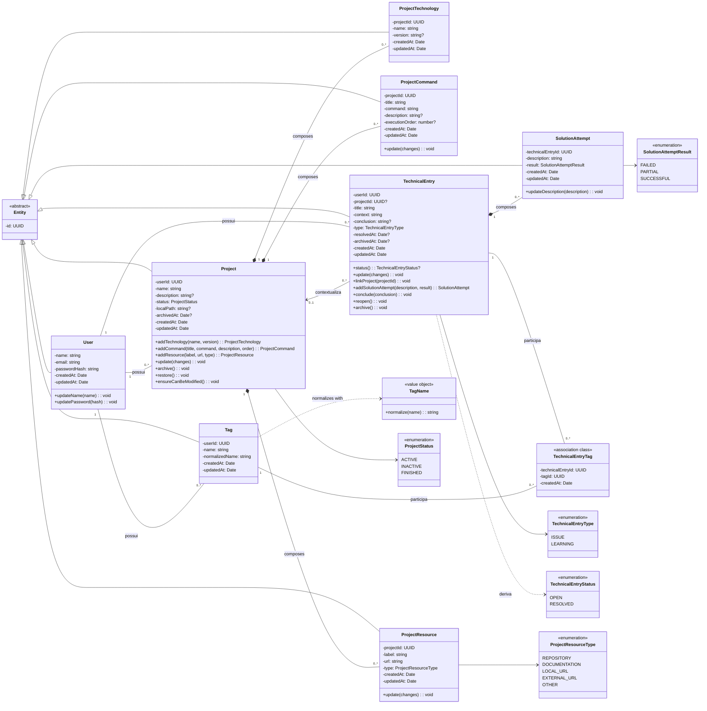

# Class diagrams

## Domain model

This is the main diagram for studying UML. It prioritizes business
concepts and omits getters, setters, DTOs, presenters, and ORM details. Attributes
with `?` are optional; attributes followed by `/` are derived.

### Reading the relationships

- `Project` composes technologies, commands, and resources because these objects
  are created within a project, have no meaning without it, and are deleted
  in a cascade.
- `TechnicalEntry` composes `SolutionAttempt` through the same lifecycle relationship.
- `TechnicalEntry` only associates with `Project`: the link is optional, and when
  the project is deleted, the entry survives with an empty `projectId`.
- `TechnicalEntryTag` materializes the many-to-many association and stores
  the assignment date. Mermaid has no native association class notation,
  so the stereotype makes its role explicit.
- `User` has ownership associations rather than domain composition.
  Although the database cascades user deletion, these objects are
  aggregates handled by their own use cases and repositories.

## Technical layer view

This second diagram does not replace the domain model. It shows the
architectural pattern repeated across NestJS modules and explains why controllers,
use cases, and repositories are not business classes in the diagram above.

The central principle is **dependency inversion**: the application knows
repository and provider contracts; Prisma, JWT, and bcrypt implementations
live in infrastructure. This allows testing use cases with doubles without
loading a database or HTTP server.

## Project state mapping

The domain and API use `ACTIVE`, `INACTIVE`, and `FINISHED`. The
Prisma/PostgreSQL enum uses `ACTIVE`, `PAUSED`, and `FINISHED`.
`ProjectModelMapper` translates `INACTIVE` ↔ `PAUSED`; this is not
inheritance or two simultaneous states, but a translation boundary between
modelos.
