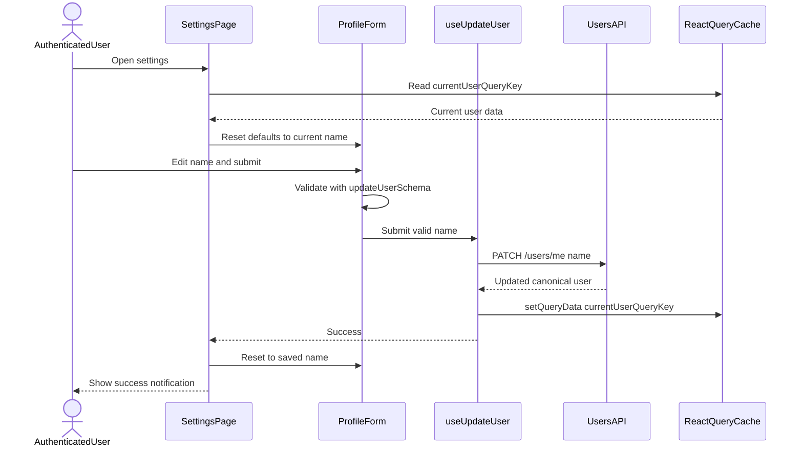
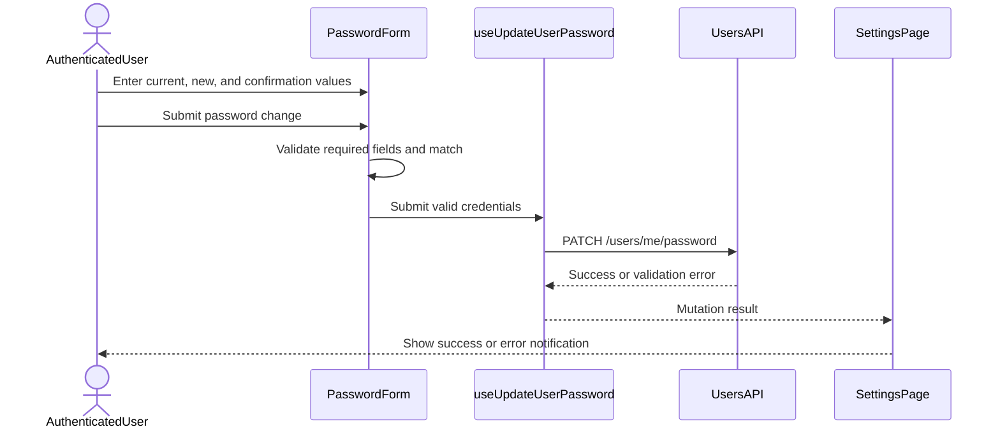

# Frontend diagrams — Account settings

These sequences describe the authenticated `/settings` forms. Zod validates
form data before the PATCH calls. The API remains responsible for validating
the request and, for a password change, verifying the current password.

## Update profile name

Invalid names stay in the form with a field error and never start a mutation.
The returned user synchronizes the account page and sidebar from the shared
cache without another GET. Mutation failures show an error notification and
leave the user's draft in place.

## Change password

On success the page clears all password fields. On failure it keeps the values
so the user can correct and resubmit. The API call still contains
`confirmPassword`, matching the existing DTO contract. The profile and password
forms have independent pending states.

## Source and related reading

- [Settings page and both forms](../../../apps/web/src/features/auth/pages/settings-page.tsx)
- [Client schemas](../../../apps/web/src/features/auth/schemas/settings.schema.ts)
- [Profile mutation and cache update](../../../apps/web/src/features/auth/hooks/use-update-user.ts)
- [Password mutation](../../../apps/web/src/features/auth/hooks/use-update-user-password.ts)
- [Validation and tests](../../guides/account-settings.md)
