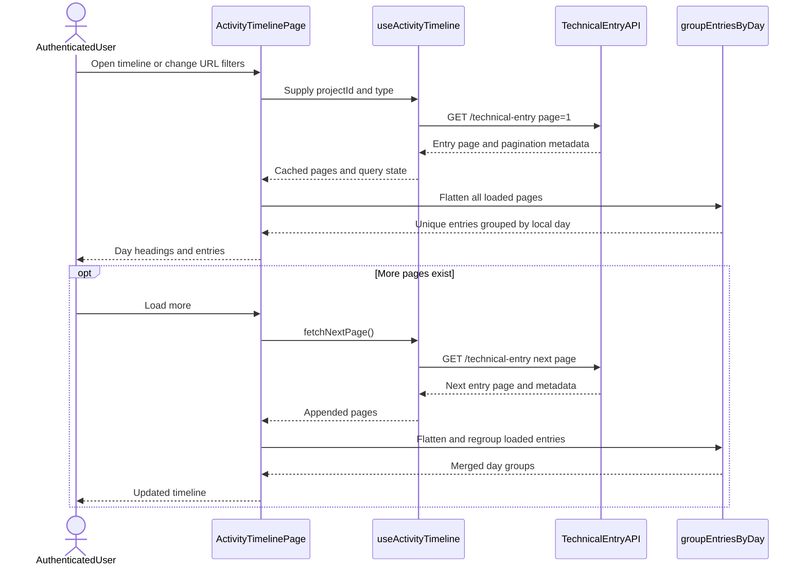
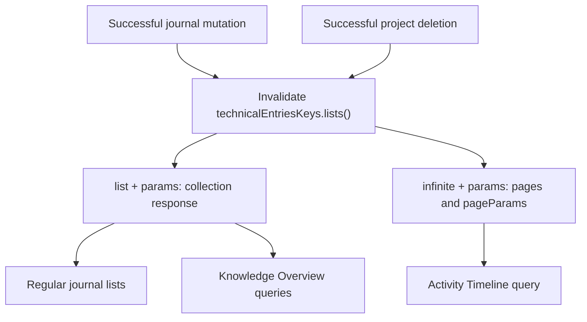

# Frontend diagrams — Activity Timeline

These flows describe the authenticated `/activity-timeline` page. The timeline
orders unarchived entries by `createdAt` and shows their current metadata. It
does not record separate creation, edit, resolve, or reopen events.

## Load and group entries

Each request uses `perPage=20`, `archivedAt=null`, `sort=createdAt`, and
`sortDir=desc`.

`meta.currentPage < meta.lastPage` determines whether another page exists.
Project/type filters belong to the URL; page numbers belong to
`useInfiniteQuery`. A new filter combination starts at page one; returning to a
cached combination can reuse its pages. The query passes its `AbortSignal` to
the request function.

Grouping after flattening prevents duplicate day headings across page
boundaries. Local calendar dates keep headings consistent with displayed times;
both use the browser's time zone. Entry IDs are deduplicated, but offset
pagination cannot prevent omissions if rows shift between requests.

Project names load separately through `useProjectOptions`, shared with
Environments and Knowledge Overview. It fetches every project page, including
archived projects; only the entry's archive state determines inclusion.
Project lookup failures leave entries visible and can be retried independently.

## Reuse journal cache invalidation

This flow shows invalidation scope rather than a sequence of HTTP requests.

Separate `list` and `infinite` segments prevent incompatible cached response
shapes from colliding. Their shared prefix lets existing mutations refresh
active consumers and mark inactive queries stale. Detail and project-detail
queries have separate invalidations outside this flow.

A next-page failure keeps earlier pages visible and allows retrying that page.
A refresh failure marks cached entries as potentially stale and blocks loading
more until a successful retry. A successful empty result has a separate state.

## Source and related reading

- [Timeline page and query states](../../../apps/web/src/features/activity-timeline/pages/activity-timeline-page.tsx)
- [Infinite query and pagination](../../../apps/web/src/features/activity-timeline/hooks/use-activity-timeline.ts)
- [Grouping and deduplication](../../../apps/web/src/features/activity-timeline/group-entries-by-day.ts)
- [Request function and query keys](../../../apps/web/src/features/technical-entry/api/list-technical-entries.ts)
- [Scope, limitations, and tests](../../guides/activity-timeline.md)
