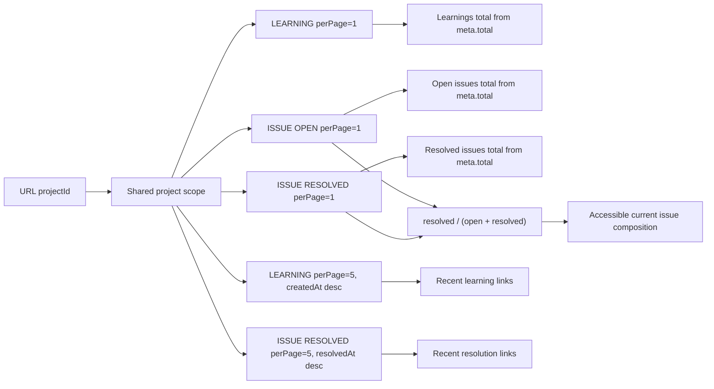
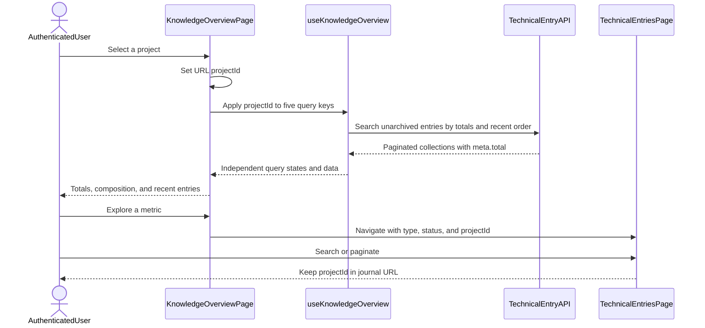

# Frontend diagrams — Knowledge Overview

The authenticated `/knowledge-overview` page composes existing technical-entry
searches to summarize the current unarchived journal. It does not create an
analytics endpoint or a historical event record.

## Query composition and issue composition

All five requests use `archivedAt=null`, `page=1`, and the optional project
scope. Total cards use `meta.total`; recent lists use the five returned records.

Each block has its own loading, error, retry, and empty states. A failed request
does not become a zero. Issue composition is calculated only after both issue
totals succeed; zero issues have no defined percentage and are shown
separately. The five requests do not form an atomic snapshot, so concurrent
changes can make their results reflect slightly different moments.

## Preserve project scope while exploring

The active journal reads and applies `projectId`, shows a project-scope banner,
and preserves the value when search or pagination changes. **Show all projects**
clears only the project scope and resets pagination; **Clear** removes all
filters. Archived projects stay selectable because their active entries can
still appear in these views. Project-option lookup failure is independent from
the journal totals.

Existing journal mutations invalidate the query-key prefix shared by the five
queries. See [Activity Timeline diagrams](activity-timeline.md#reuse-journal-cache-invalidation)
for the list/infinite cache distinction.

## Source and related reading

- [Overview page and URL navigation](../../../apps/web/src/features/knowledge-overview/pages/knowledge-overview-page.tsx)
- [Five queries](../../../apps/web/src/features/knowledge-overview/hooks/use-knowledge-overview.ts)
- [Derived composition and accessibility](../../../apps/web/src/features/knowledge-overview/components/issue-composition.tsx)
- [Journal project scope](../../../apps/web/src/features/technical-entry/pages/technical-entries-page.tsx)
- [Metrics, limitations, and tests](../../guides/knowledge-overview.md)
