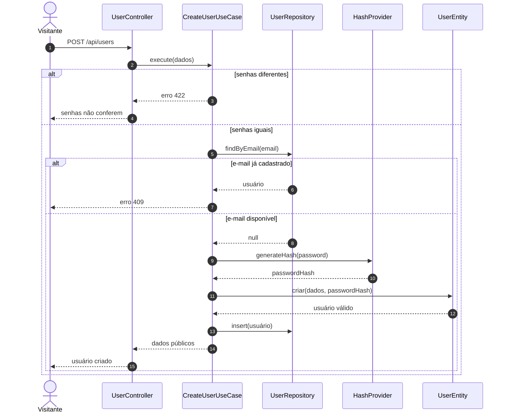
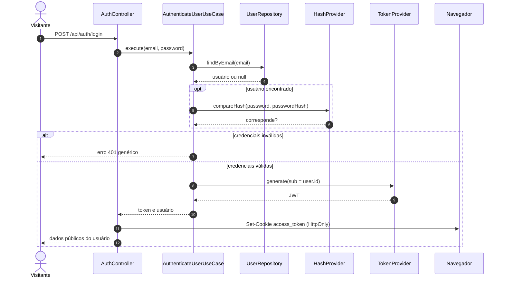
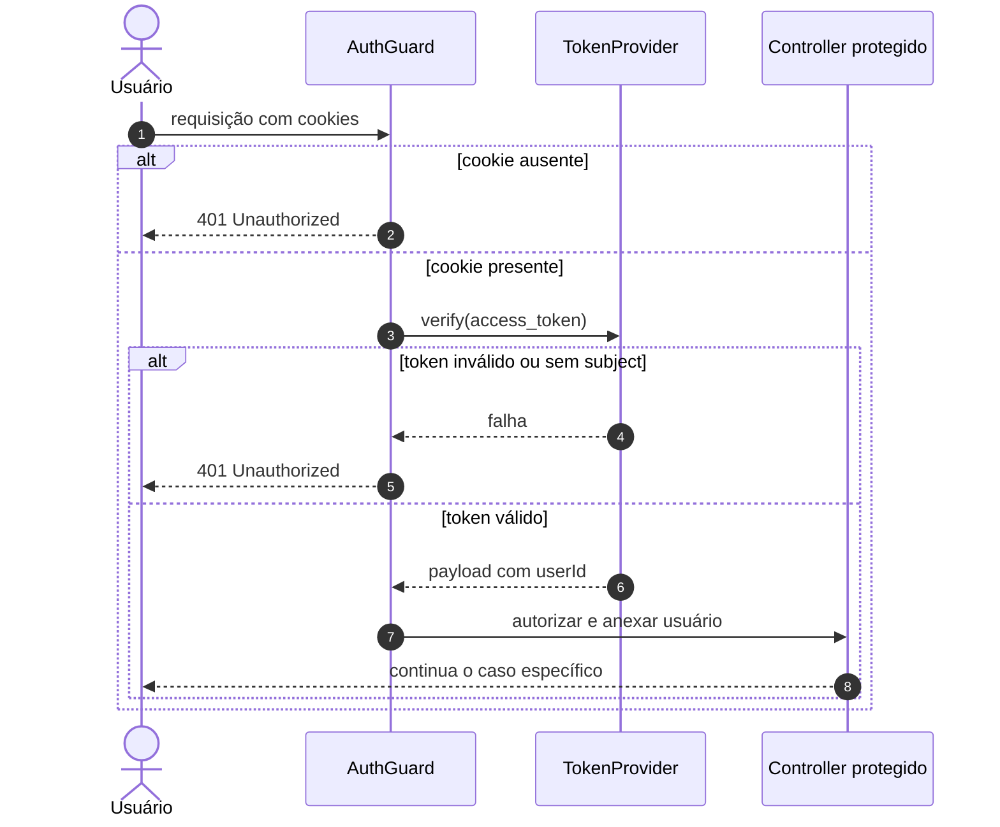
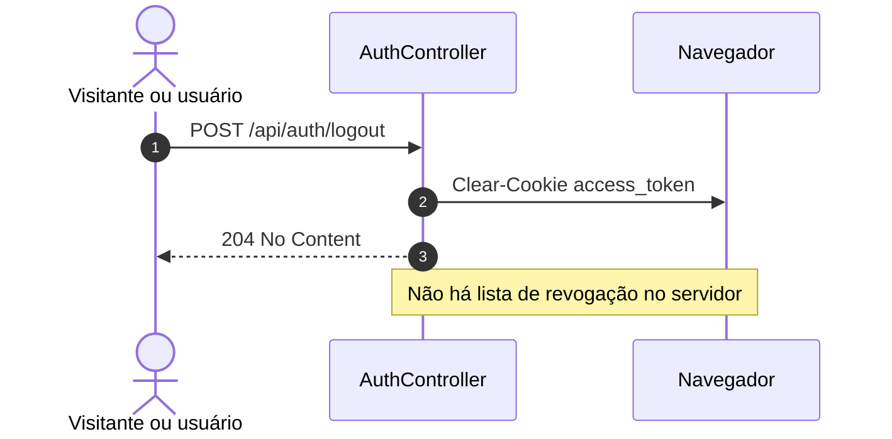
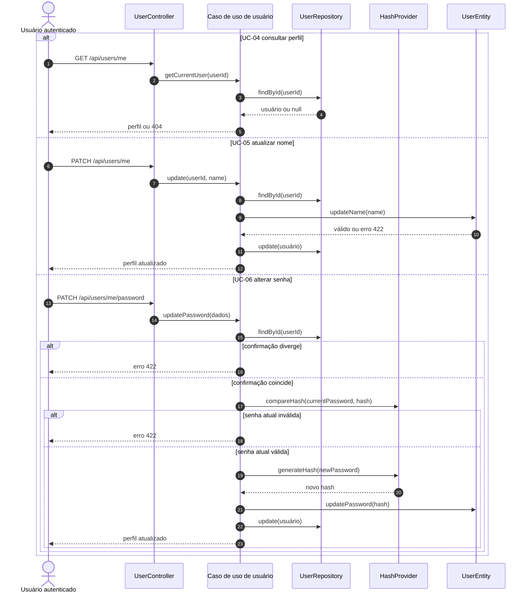
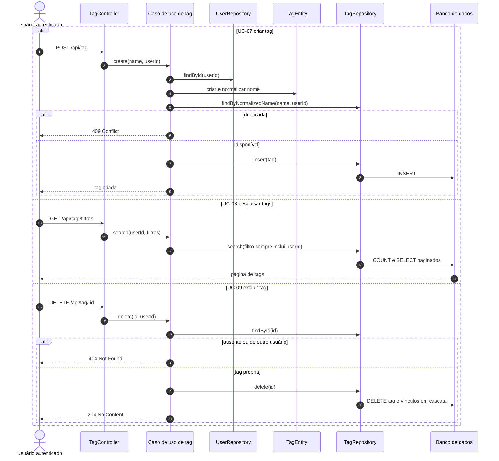

# Diagramas de sequência — conta, autenticação e tags

Os diagramas mostram responsabilidades, não cada linha de código. Validação
global de DTO e serialização aparecem somente quando relevantes ao fluxo.

## UC-01 — Cadastrar usuário

## UC-02 — Autenticar usuário

## Autenticar uma requisição protegida

Esta interação é uma pré-condição comum aos casos UC-04 a UC-43.

## UC-03 — Encerrar sessão

## UC-04 a UC-06 — Gerenciar o próprio perfil

## UC-07 a UC-09 — Gerenciar tags

