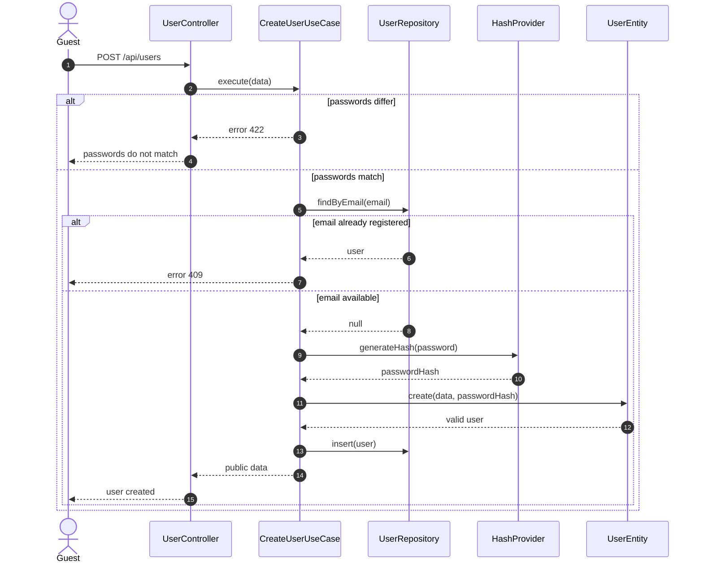
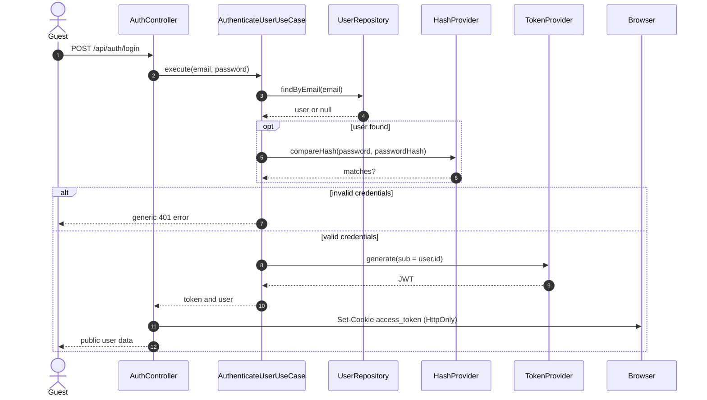
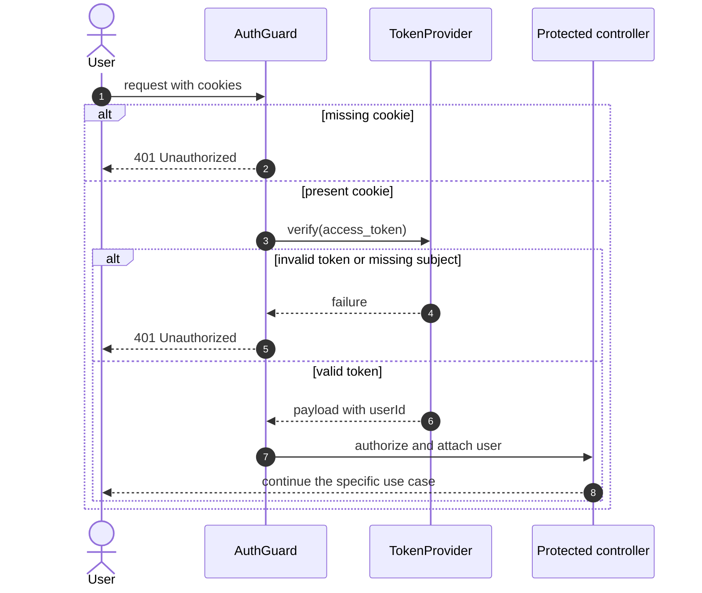
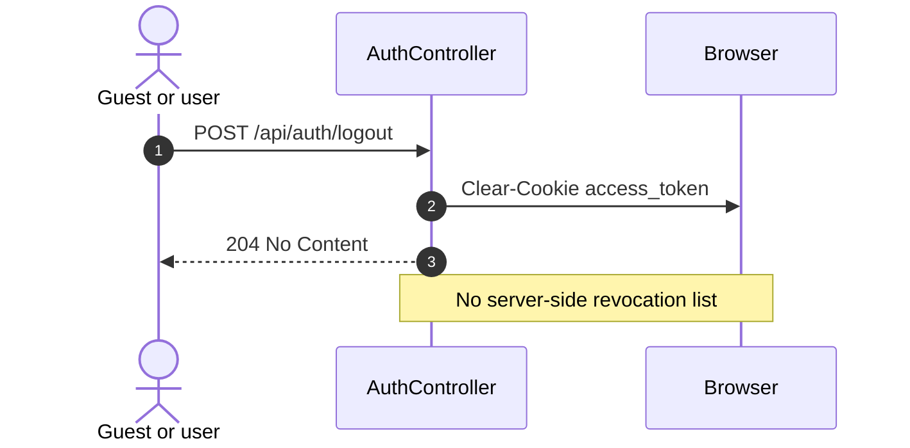
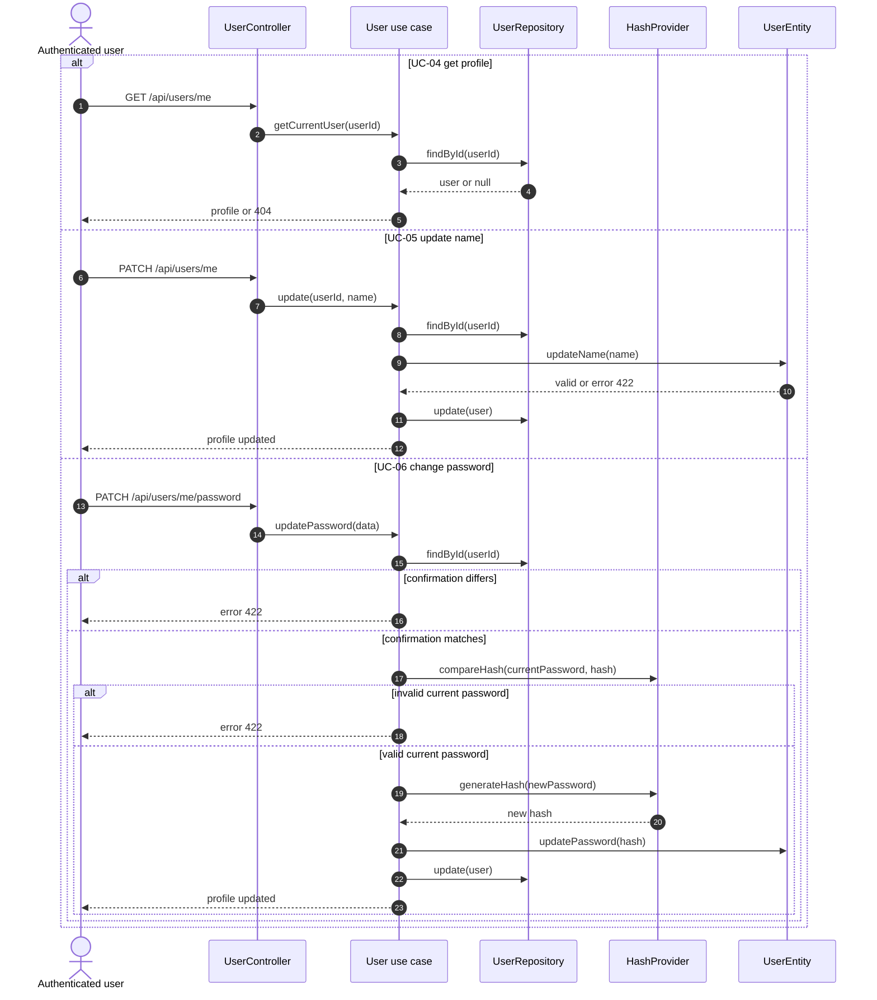
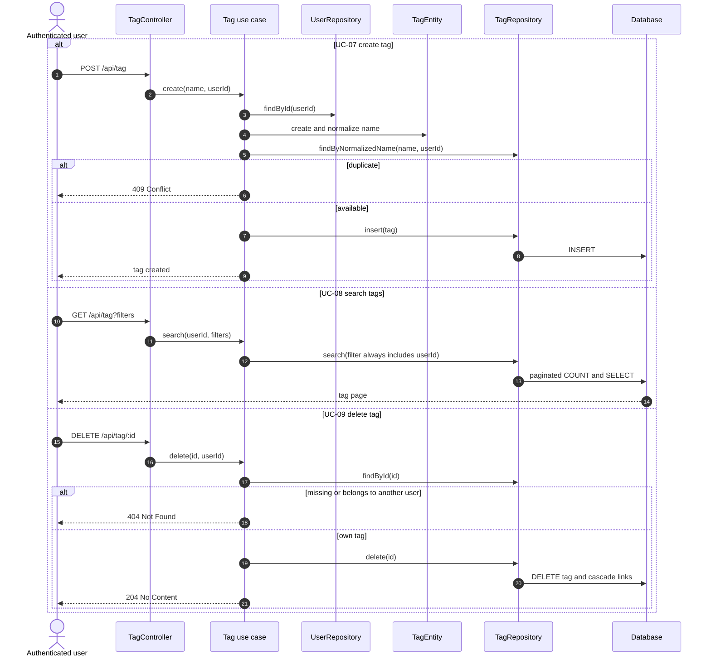

# Sequence diagrams — account, authentication, and tags

Diagrams show responsibilities, not every line of code. Global DTO validation
and serialization appear only when relevant to the flow.

## UC-01 — Register user

## UC-02 — Authenticate user

## Authenticate a protected request

This interaction is a shared precondition for UC-04 through UC-43.

## UC-03 — End session

## UC-04 through UC-06 — Manage own profile

## UC-07 through UC-09 — Manage tags

