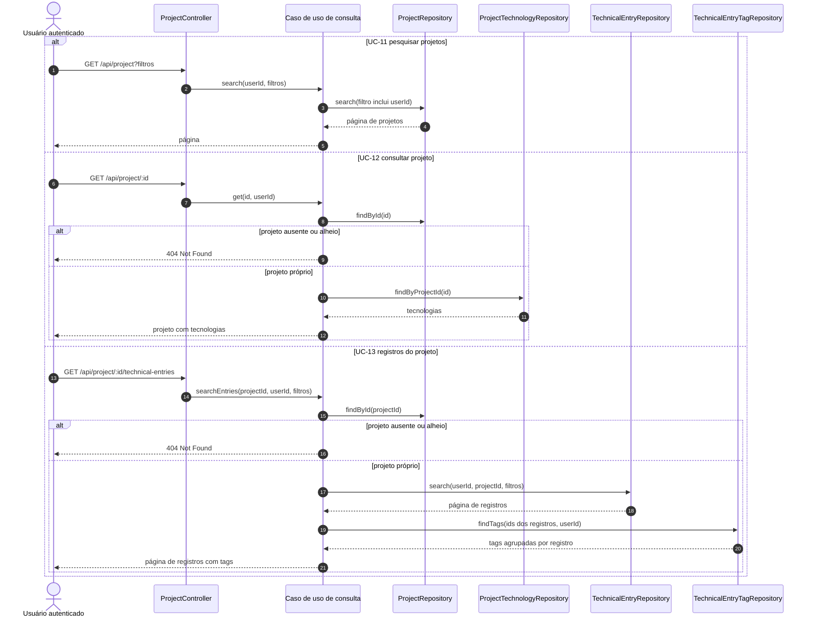
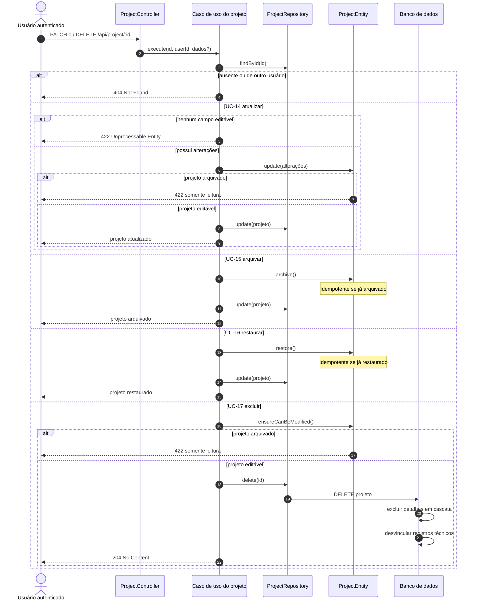
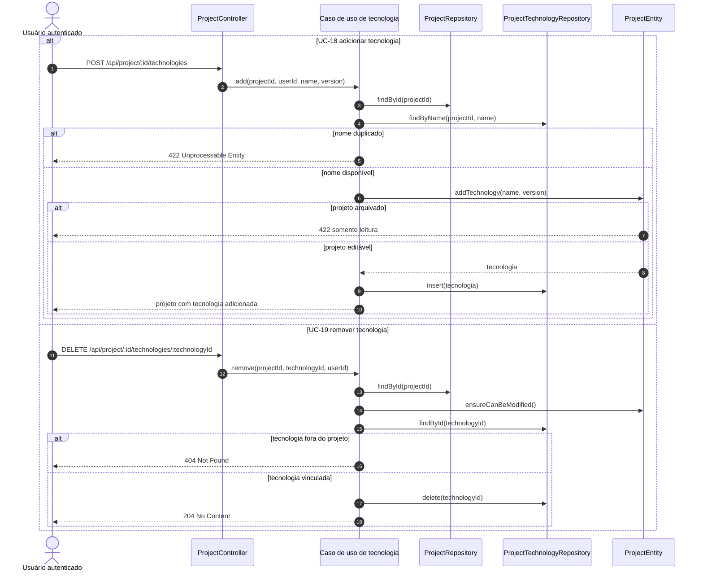
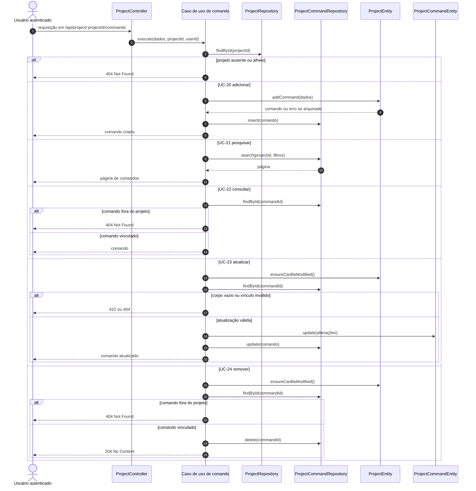
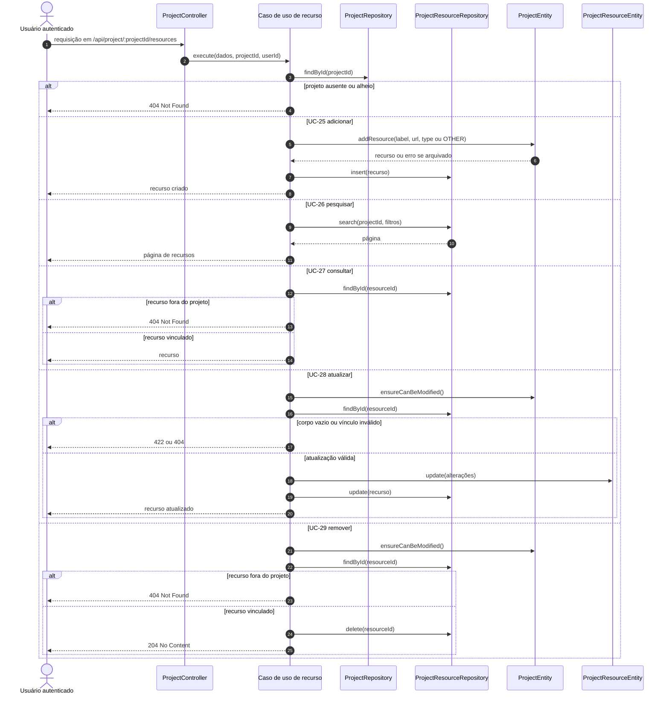

# Diagramas de sequência — projetos

## UC-10 — Criar projeto

## UC-11 a UC-13 — Consultar projetos e seus registros

## UC-14 a UC-17 — Ciclo de vida do projeto

## UC-18 e UC-19 — Tecnologias do projeto

## UC-20 a UC-24 — Comandos do projeto

## UC-25 a UC-29 — Recursos do projeto

