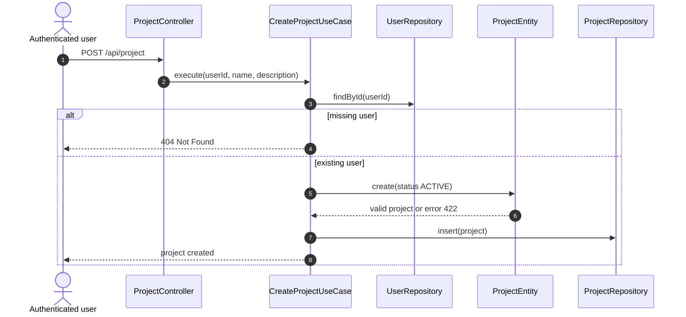
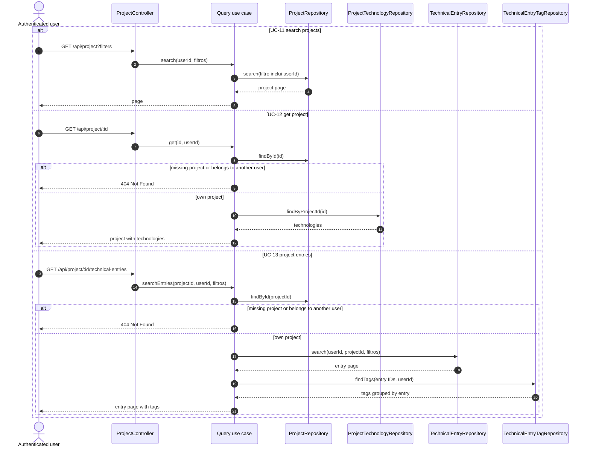
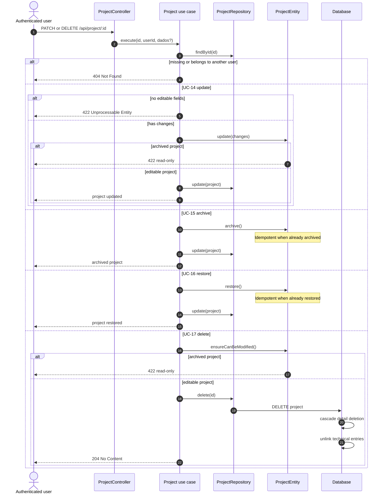
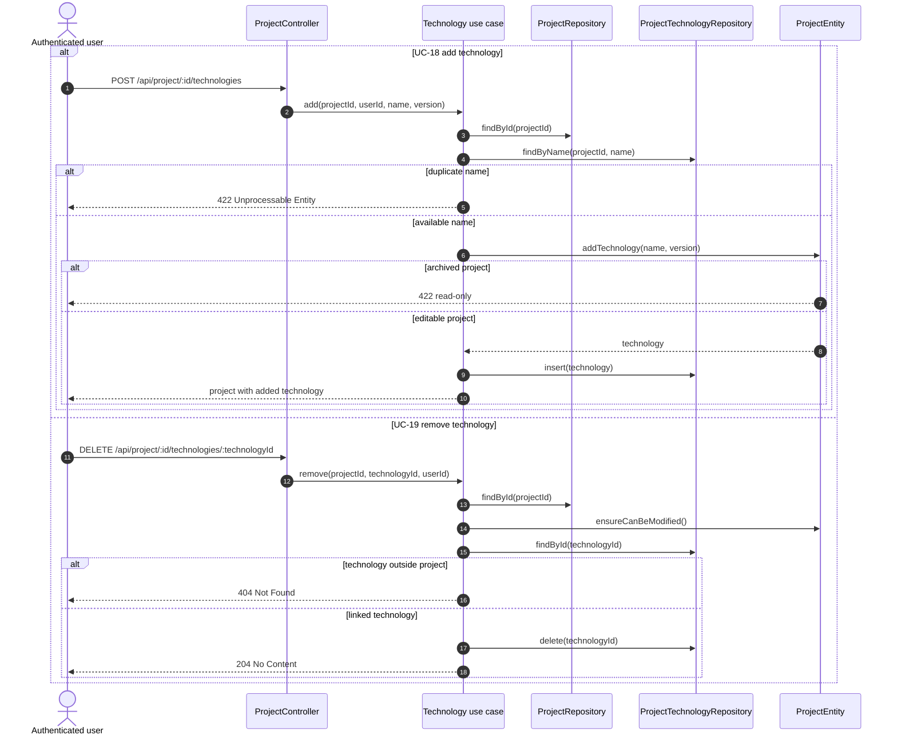
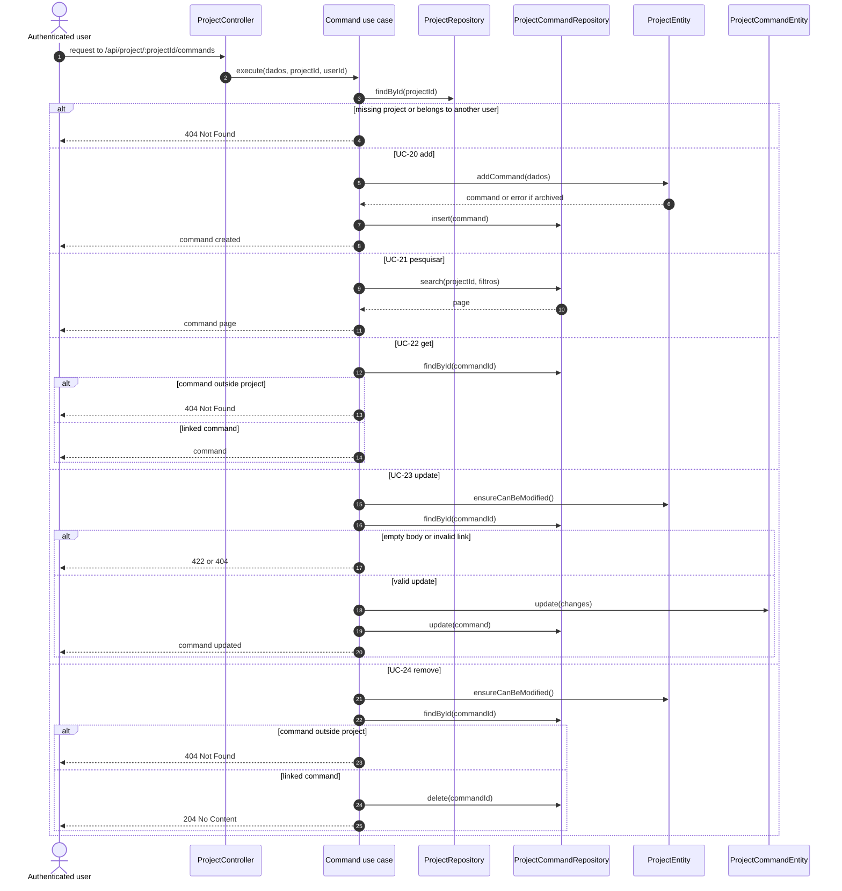
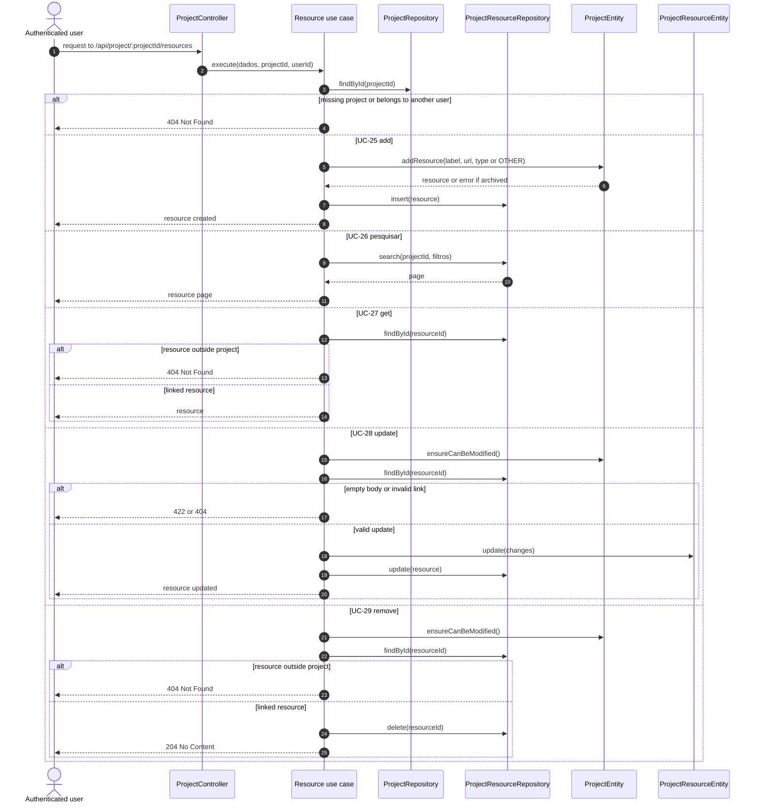

# Sequence diagrams — projects

## UC-10 — Create project

## UC-11 through UC-13 — Query projects and their entries

## UC-14 through UC-17 — Project lifecycle

## UC-18 and UC-19 — Project technologies

## UC-20 through UC-24 — Project commands

## UC-25 through UC-29 — Project resources

