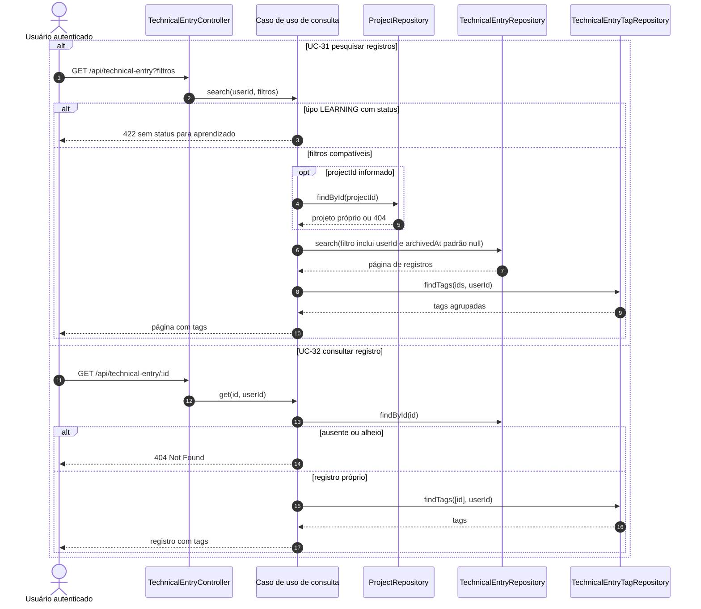
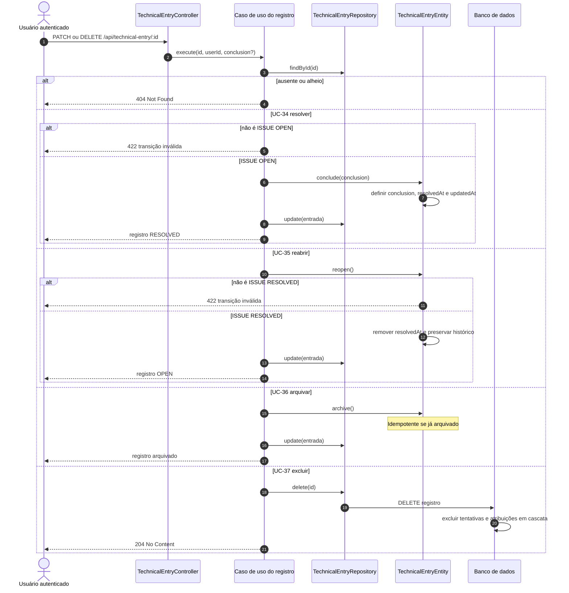
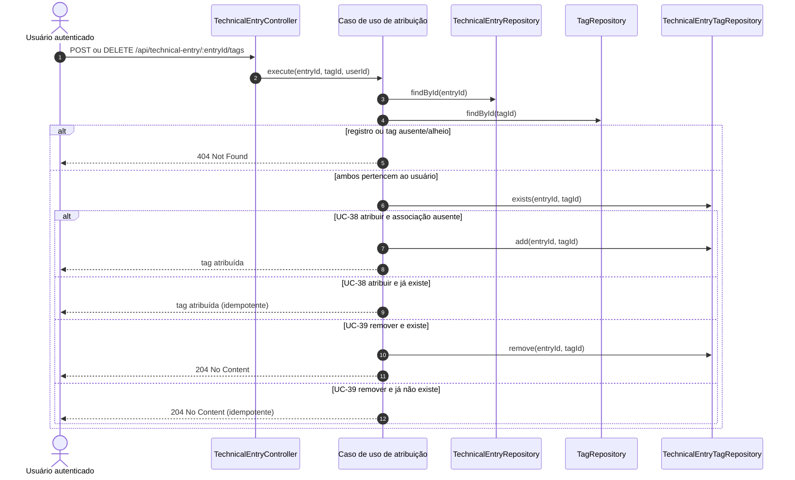
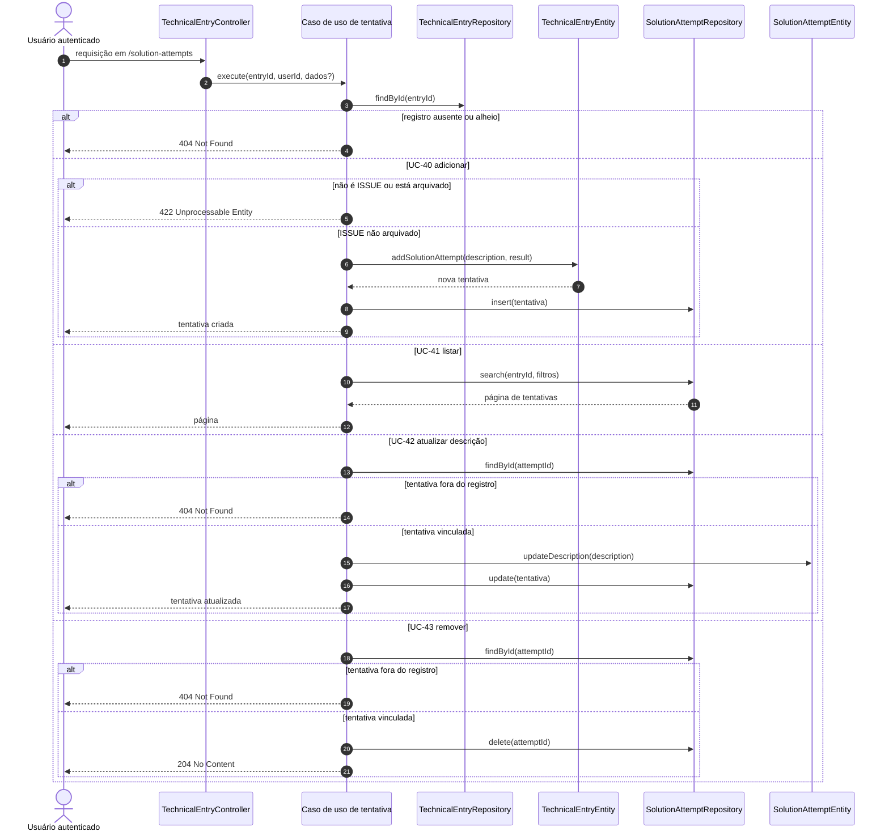

# Diagramas de sequência — registros técnicos

## UC-30 — Criar registro técnico


## UC-31 e UC-32 — Pesquisar e consultar registros



## UC-33 — Atualizar registro técnico

```mermaid
sequenceDiagram
    autonumber
    actor Usuario as Usuário autenticado
    participant C as TechnicalEntryController
    participant UC as UpdateTechnicalEntryUseCase
    participant ERepo as TechnicalEntryRepository
    participant PRepo as ProjectRepository
    participant Entry as TechnicalEntryEntity

    Usuario->>C: PATCH /api/technical-entry/:id
    C->>UC: execute(id, userId, alterações)
    UC->>ERepo: findById(id)
    alt ausente ou alheio
        UC-->>Usuario: 404 Not Found
    else corpo sem alteração
        UC-->>Usuario: 422 Unprocessable Entity
    else atualização solicitada
        opt novo projectId é string
            UC->>PRepo: findById(projectId)
            alt projeto ausente, alheio ou arquivado
                UC-->>Usuario: 404 Projeto não encontrado
            end
        end
        UC->>Entry: update(alterações)
        Note over Entry: null remove projeto/conclusão; ausente preserva
        Entry-->>UC: entrada válida ou erro 422
        UC->>ERepo: update(entrada)
        UC-->>Usuario: registro atualizado
    end
```

## UC-34 a UC-37 — Estado, arquivamento e exclusão



## UC-38 e UC-39 — Classificar registro com tags



## UC-40 a UC-43 — Tentativas de solução



O fragmento combinado final evidencia uma assimetria atual: só a criação de
tentativa verifica se o registro é `ISSUE` não arquivado. Consulta, atualização
e remoção verificam propriedade e vínculo, mas não o arquivamento.
