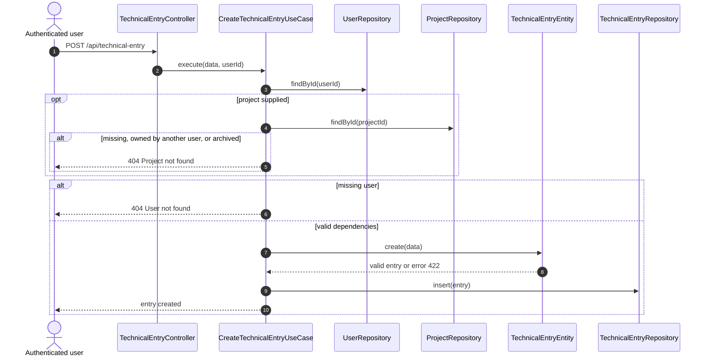
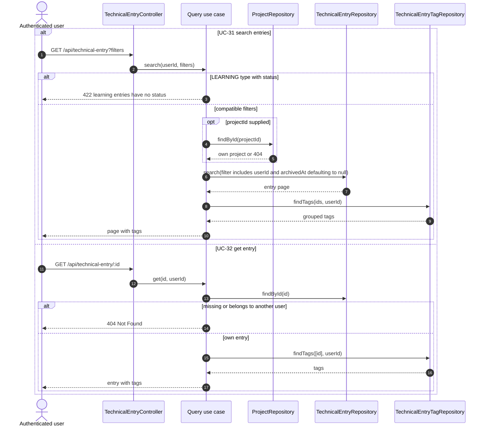
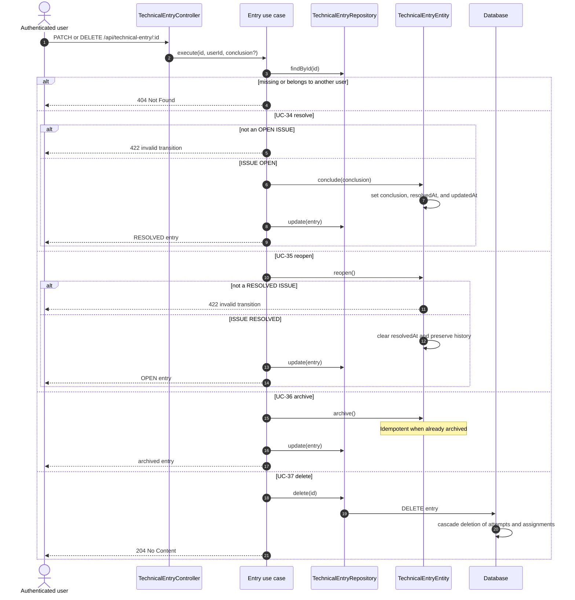
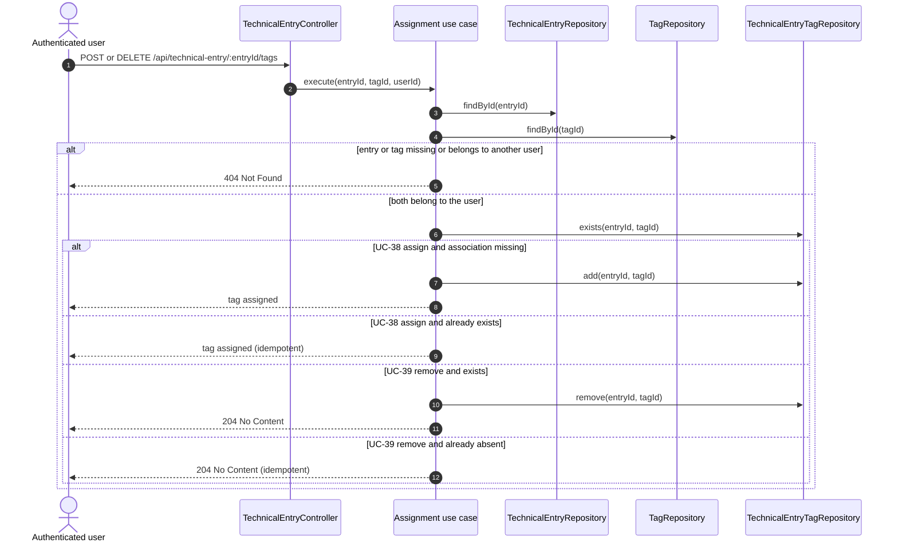
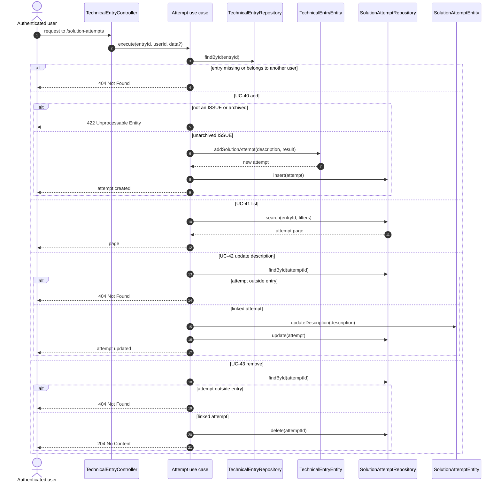

# Sequence diagrams — technical entries

## UC-30 — Create technical entry



## UC-31 and UC-32 — Search and retrieve entries



## UC-33 — Update technical entry

```mermaid
sequenceDiagram
    autonumber
    actor UserActor as Authenticated user
    participant C as TechnicalEntryController
    participant UC as UpdateTechnicalEntryUseCase
    participant ERepo as TechnicalEntryRepository
    participant PRepo as ProjectRepository
    participant Entry as TechnicalEntryEntity

    UserActor->>C: PATCH /api/technical-entry/:id
    C->>UC: execute(id, userId, changes)
    UC->>ERepo: findById(id)
    alt missing or belongs to another user
        UC-->>UserActor: 404 Not Found
    else body without changes
        UC-->>UserActor: 422 Unprocessable Entity
    else update requested
        opt new projectId is a string
            UC->>PRepo: findById(projectId)
            alt project missing, owned by another user, or archived
                UC-->>UserActor: 404 Project not found
            end
        end
        UC->>Entry: update(changes)
        Note over Entry: null clears project/conclusion; omission preserves them
        Entry-->>UC: valid entry or error 422
        UC->>ERepo: update(entry)
        UC-->>UserActor: entry updated
    end
```

## UC-34 through UC-37 — State, archiving, and deletion



## UC-38 and UC-39 — Classify an entry with tags



## UC-40 through UC-43 — Solution attempts



The final combined fragment highlights a current asymmetry: only creating an
attempt checks for an unarchived `ISSUE`. Queries, updates,
and removal check ownership and membership, but not archiving.
