# DevLog — Planned use cases (historical document)

> [!WARNING]
> This file records the originally planned MVP vision and may contain
> behavior not yet exposed by the API. For the **as-is** documentation,
> extracted from the current code, start with the [use case index](README.md).

This document describes the main use cases of the DevLog MVP.

The goal is to serve as a backend implementation reference, especially for the `application` layer.

---

# 1. Overview

DevLog has two main features:

1. **Technical journal**

   - record issues encountered;
   - record learnings;
   - document solution attempts;
   - record the solution/conclusion;
   - classify entries using tags;
   - associate an entry with a project.

2. **Projects**

   - record projects;
   - document technologies used;
   - store important commands;
   - store links and resources;
   - view technical entries associated with the project.

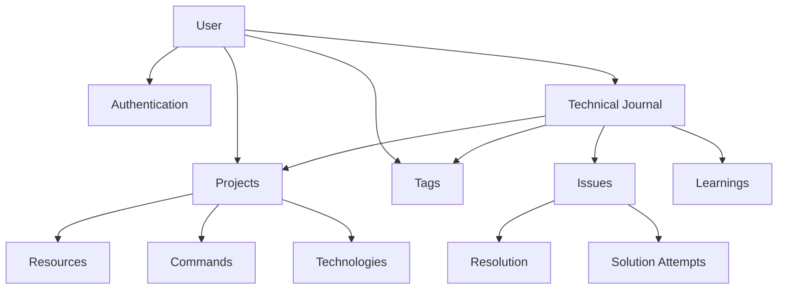

---

# 2. Actors

The MVP has only one actor:

```text
User
```

The system is personal, but will still include authentication to support studying:

- HttpOnly cookies;
- authorization;
- data isolation;
- JWT or sessions;
- guards;
- authentication tests.

Each resource belongs to a user.

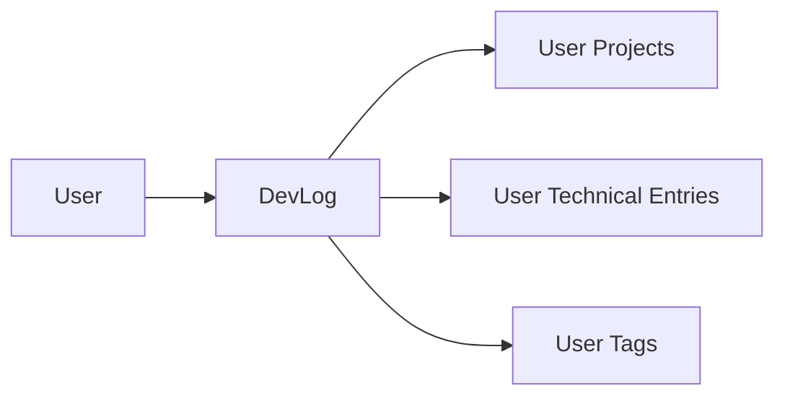

A user must never access resources belonging to another user.

---

# 3. Authentication

Use cases related to accounts and authentication.

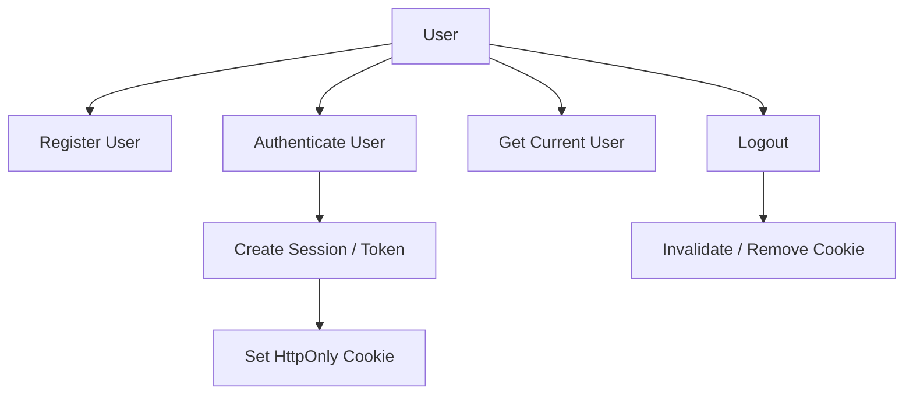

## RegisterUser

Creates a new account.

### Input

```text
name
email
password
```

### Rules

- email must be valid;
- email must not already be registered;
- password must meet the minimum requirements;
- password is never stored directly;
- password must be hashed.

### Output

```text
User
```

---

## AuthenticateUser

Authenticates a user.

### Input

```text
email
password
```

### Flow

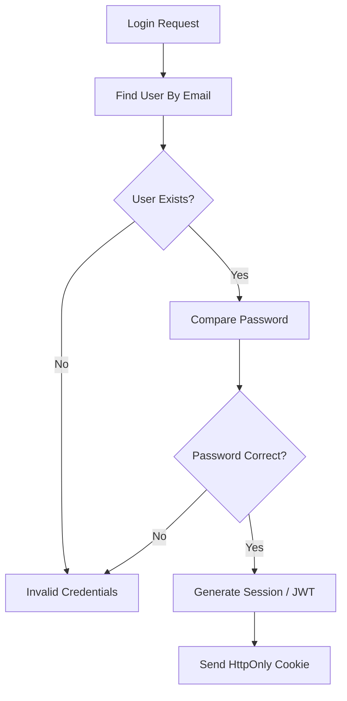

---

## GetCurrentUser

Returns the authenticated user's data.

Example:

```text
GET /users/me
```

---

## LogoutUser

Ends the current authentication session.

Depending on the chosen strategy:

```text
Simple JWT:
    remove cookie

Refresh/session:
    invalidate session
    remove cookie
```

---

# 4. Projects

The project provides context for technical entries.

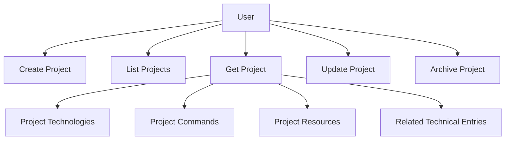

---

## CreateProject

Creates a project.

### Input

```text
name
description?
repositoryUrl?
localPath?
status?
```

### Rules

- project belongs to the authenticated user;
- name is required;
- repositoryUrl, if supplied, must be a valid URL.

---

## UpdateProject

Updates general project information.

Examples:

```text
name
description
repository
local path
status
```

### Main rule

Only the owner can modify the project.

The update is partial: omitted properties remain unchanged. For the
optional `description` and `localPath` fields, `null` removes the existing
content. A request without any editable field is invalid.

---

## GetProject

Returns a specific project.

The result may eventually include:

```text
Project

Technologies
Commands
Resources
Technical Entries
```

---

## ListProjects

Lists the user's projects.

Possible filters:

```text
status
archived
name
technology
```

The MVP does not need to implement all of them.

Initially:

```text
name
status
```

are sufficient.

---

## ArchiveProject

Archives a project.

There is no need to physically delete the record.

```text
ACTIVE
    ↓
ARCHIVED
```

Existing technical entries remain associated with the project.

Archiving and restoration are explicit, idempotent commands:

```text
ArchiveProject -> set archivedAt
RestoreProject -> clear archivedAt
```

---

# 5. Project Technologies

Represent technologies used in a project.

Example:

```text
DevLog

NestJS
PostgreSQL
Prisma
React
Docker
```

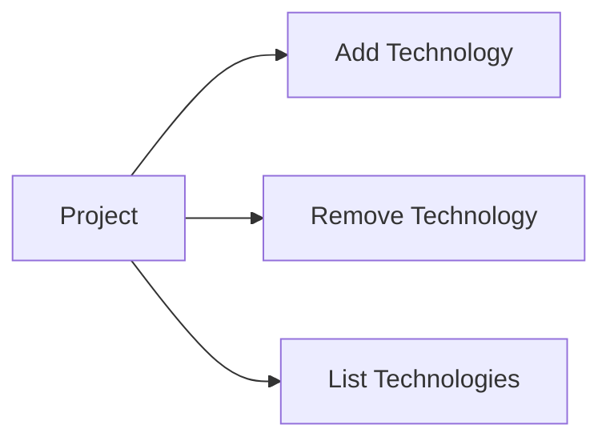

---

## AddProjectTechnology

### Input

```text
projectId
name
version?
```

Example:

```text
NestJS
11
```

### Rules

- the project must belong to the user;
- do not add the same technology to a project twice.

---

## RemoveProjectTechnology

Removes a technology from the project.

This does not remove technical entries using a tag with the same name.

Project technologies and tags are different concepts.

---

# 6. Project Commands

Documents how to work with a particular project.

Example:

```text
Start development

pnpm dev
```

Another:

```text
Run migrations

pnpm --filter api exec prisma migrate dev
```

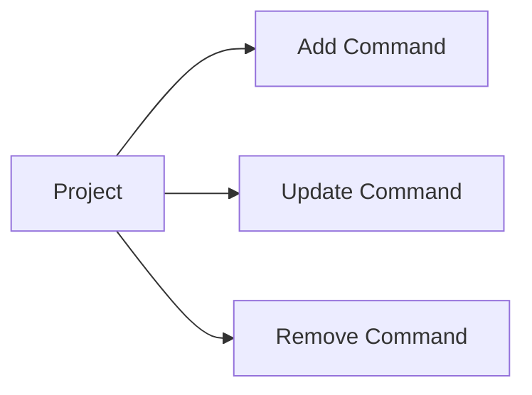

---

## AddProjectCommand

### Input

```text
projectId
title
command
description?
```

Example:

```text
title:
Start API

command:
pnpm --filter api dev
```

---

# 7. Project Resources

Links related to the project.

Examples:

```text
GitHub Repository
Swagger
Documentation
Figma
Production URL
Staging URL
```

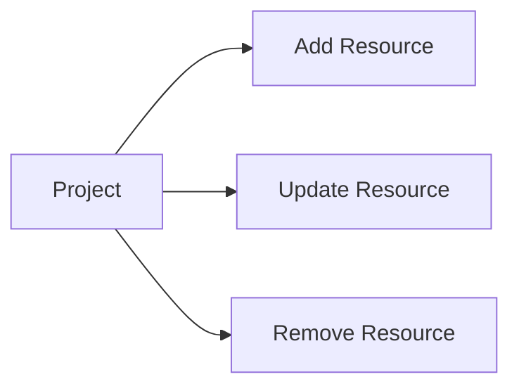

### Structure

```text
label
url
type?
```

---

# 8. Technical Entries

This is DevLog's main feature.

An entry represents something learned or an issue encountered.

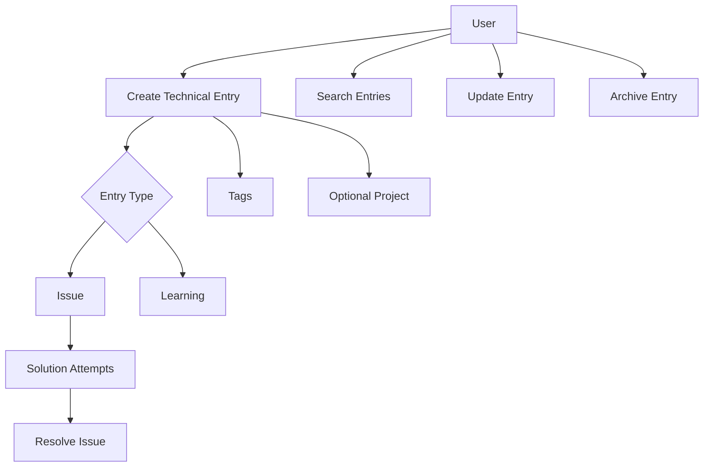

---

# 9. CreateTechnicalEntry

Creates a journal entry.

### Input

```text
title
type
context
conclusion?
projectId?
tags?
```

Initially, there are two types:

```text
ISSUE
LEARNING
```

---

## ISSUE

Represents an issue encountered.

Example:

```text
Title:
Cookie not being sent to the API

Context:
React running on :5173 and NestJS on :3000.

Problem:
Authentication cookie was not included in requests.
```

May have:

```text
SolutionAttempts[]
```

And eventually:

```text
resolution
resolvedAt
```

---

## LEARNING

Represents something learned that did not necessarily originate from an error.

Example:

```text
Title:
Prisma migrate dev does not generate the client in Prisma 7

Context:
After applying a migration the generated client was outdated.

Conclusion:
Run prisma generate explicitly.
```

Does not need solution attempts.

---

# 10. UpdateTechnicalEntry

Allows changing entry content.

Can change:

```text
title
context
conclusion
project
tags
```

### Restrictions

The entry type should not be changed freely once it starts exhibiting type-specific behavior.

Example:

```text
ISSUE with SolutionAttempts
```

should not simply become:

```text
LEARNING
```

without explicit handling.

For the MVP, it may be simpler to prevent changing `type` after creation.

An entry with `resolvedAt` set must always retain a nonempty
conclusion. Therefore, a regular update cannot remove the conclusion of a resolved
entry; the state transition remains the responsibility of `ResolveTechnicalIssue`
and `ReopenTechnicalIssue`.

---

# 11. GetTechnicalEntry

Returns the complete entry.

Example:

```text
Technical Entry

Title
Type
Context
Conclusion
Project
Tags

if ISSUE:
    Solution Attempts
    Status
```

---

# 12. ListTechnicalEntries

This will likely be the application's most frequently used query.

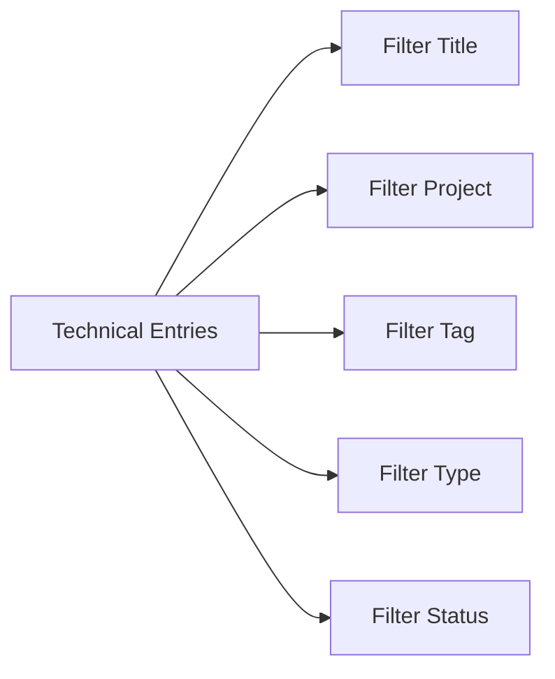

Possible filters:

```text
title
projectId
tagId
type
status
```

The `title` filter searches for case-insensitive partial matches.

Example:

```text
title = cookie
projectId = 5ab0c050-5050-4d2b-b0a0-44247985de2b
tagId = 6bc1d161-6161-4e3c-a1b1-55358096ef3c
type = ISSUE
status = RESOLVED
```

---

# 13. Solution Attempts

These exist only for entries of type `ISSUE`.

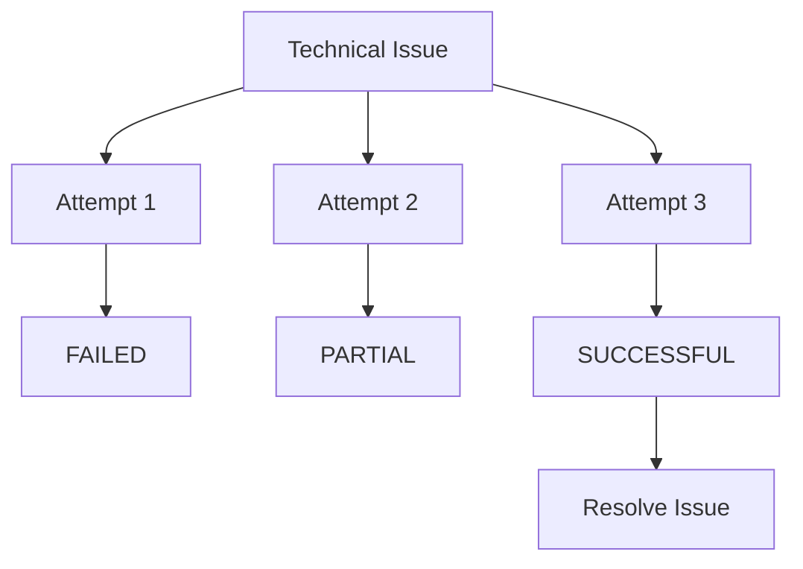

---

## AddSolutionAttempt

Records an attempt to resolve an issue.

### Input

```text
entryId
description
result
```

Outcome:

```text
FAILED
PARTIAL
SUCCESSFUL
```

### Rules

- the entry must belong to the user;
- the entry must be an `ISSUE`;
- entries of type `LEARNING` do not have attempts;
- an archived issue should not receive new attempts.

---

# 14. ResolveTechnicalIssue

Marks an issue as resolved.

```text
OPEN
 ↓
RESOLVED
```

### Input

```text
entryId
conclusion
```

There may be an associated successful attempt, but this does not need to be mandatory.

Example:

```text
Conclusion:

The API was correctly configured.
The actual issue was that fetch did not use credentials: include.
```

### Rules

- only an `ISSUE` can be resolved;
- a conclusion is required;
- records `resolvedAt`.

---

# 15. ReopenTechnicalIssue

Allows reopening an issue.

```text
RESOLVED
   ↓
OPEN
```

The attempt history and previous solution remain recorded.

This matters because an issue may appear resolved and later recur.

---

# 16. Tags

Tags classify knowledge.

Examples:

```text
NestJS
Docker
React
Prisma
PostgreSQL
Cookies
Authentication
DDD
Testing
```

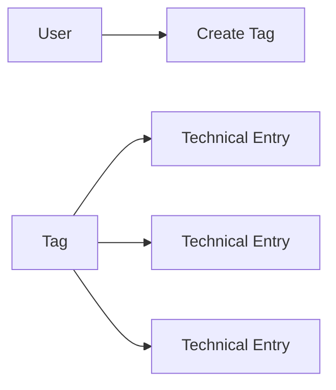

An entry can have multiple tags:

```text
Cookie not being sent

Tags:
- NestJS
- React
- Authentication
- Cookies
```

---

## CreateTag

### Input

```text
name
```

### Rules

- belongs to the user;
- do not allow two tags with the same name for the same user.

---

## AddTagToTechnicalEntry

Associates an existing tag with an entry.

### Rule

Both the tag and entry must belong to the authenticated user.

---

## RemoveTagFromTechnicalEntry

Removes only the association.

Does not remove the tag.

---

# 17. Project × Technical Entry relationship

This relationship is important to DevLog's concept.

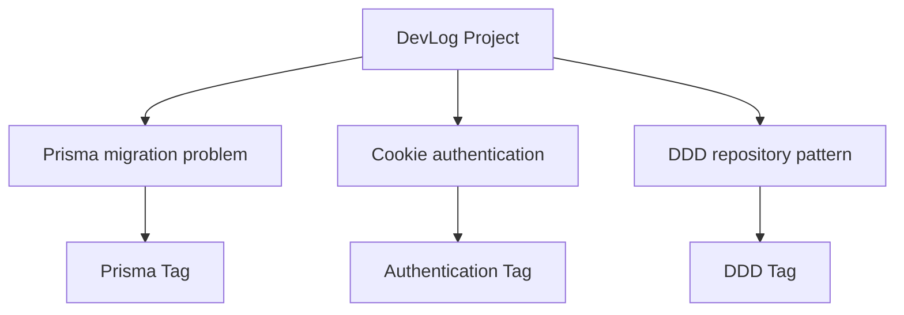

A project represents:

```text
Where did this happen?
```

A tag represents:

```text
What is this about?
```

Example:

```text
Technical Entry:
Cookie HttpOnly not being sent

Project:
DevLog

Tags:
NestJS
React
Cookies
Authentication
```

---

# 18. Main user flow

An expected usage flow would be:

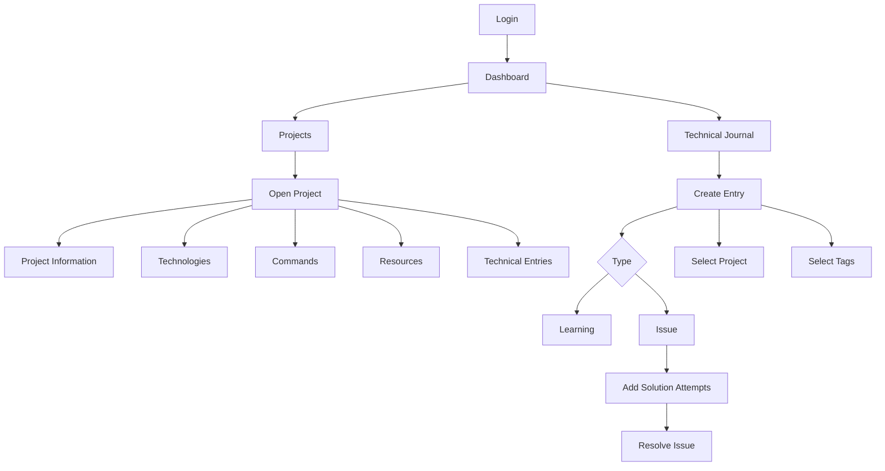

---

# 19. MVP use cases

## Authentication

```text
RegisterUser
AuthenticateUser
GetCurrentUser
LogoutUser
```

## Projects

```text
CreateProject
UpdateProject
GetProject
ListProjects
ArchiveProject
```

## Project Technologies

```text
AddProjectTechnology
RemoveProjectTechnology
```

## Project Commands

```text
AddProjectCommand
UpdateProjectCommand
RemoveProjectCommand
```

## Project Resources

```text
AddProjectResource
UpdateProjectResource
RemoveProjectResource
```

## Technical Entries

```text
CreateTechnicalEntry
UpdateTechnicalEntry
GetTechnicalEntry
ListTechnicalEntries
ArchiveTechnicalEntry
```

## Issues

```text
AddSolutionAttempt
ResolveTechnicalIssue
ReopenTechnicalIssue
```

## Tags

```text
CreateTag
ListTags
AddTagToTechnicalEntry
RemoveTagFromTechnicalEntry
```

---

# 20. Application layer representation

This can map directly to the NestJS structure.

```text
src/
└── modules/
    ├── users/
    │   └── application/
    │       └── use-cases/
    │           ├── register-user.use-case.ts
    │           └── get-current-user.use-case.ts
    │
    ├── auth/
    │   └── application/
    │       └── use-cases/
    │           ├── authenticate-user.use-case.ts
    │           └── logout-user.use-case.ts
    │
    ├── projects/
    │   └── application/
    │       └── use-cases/
    │           ├── create-project.use-case.ts
    │           ├── update-project.use-case.ts
    │           ├── get-project.use-case.ts
    │           ├── list-projects.use-case.ts
    │           ├── archive-project.use-case.ts
    │           ├── add-project-technology.use-case.ts
    │           ├── add-project-command.use-case.ts
    │           └── add-project-resource.use-case.ts
    │
    ├── technical-entries/
    │   └── application/
    │       └── use-cases/
    │           ├── create-technical-entry.use-case.ts
    │           ├── update-technical-entry.use-case.ts
    │           ├── get-technical-entry.use-case.ts
    │           ├── list-technical-entries.use-case.ts
    │           ├── archive-technical-entry.use-case.ts
    │           ├── add-solution-attempt.use-case.ts
    │           ├── resolve-technical-issue.use-case.ts
    │           └── reopen-technical-issue.use-case.ts
    │
    └── tags/
        └── application/
            └── use-cases/
                ├── create-tag.use-case.ts
                ├── list-tags.use-case.ts
                ├── add-tag-to-entry.use-case.ts
                └── remove-tag-from-entry.use-case.ts
```

---

# 21. Suggested implementation order

There is no need to implement every use case at once.

An order that allows studying the layers gradually is:

```text
1. Shared/domain base

2. Users
   └── RegisterUser

3. Authentication
   ├── AuthenticateUser
   ├── GetCurrentUser
   └── LogoutUser

4. Technical Entries
   ├── CreateTechnicalEntry
   ├── GetTechnicalEntry
   ├── ListTechnicalEntries
   └── UpdateTechnicalEntry

5. Tags
   ├── CreateTag
   ├── ListTags
   └── associate tags with entries

6. Projects
   ├── CreateProject
   ├── GetProject
   ├── ListProjects
   └── UpdateProject

7. Associate
   TechnicalEntry -> Project

8. Issues
   ├── AddSolutionAttempt
   ├── ResolveTechnicalIssue
   └── ReopenTechnicalIssue

9. Project details
   ├── Technologies
   ├── Commands
   └── Resources

10. Archive
    ├── ArchiveProject
    └── ArchiveTechnicalEntry
```

---

# 22. Essential versus complete MVP

Not every use case needs to exist before starting to use DevLog.

## First usable MVP

```text
RegisterUser
AuthenticateUser

CreateTechnicalEntry
UpdateTechnicalEntry
GetTechnicalEntry
ListTechnicalEntries

CreateTag
ListTags

CreateProject
GetProject
ListProjects
```

This already makes it possible to:

```text
Create project
    ↓
Create technical entry
    ↓
Associate entry with project
    ↓
Add tags
    ↓
Search later
```

Later:

```text
Solution Attempts
Project Commands
Technologies
Resources
Archive
```

can be added incrementally.

---

# 23. Main conceptual rule

DevLog should primarily answer three questions:

```text
What did I learn?
    → TechnicalEntry

Where did I learn/encounter this?
    → Project

About which topic?
    → Tag
```

For issues, there is a fourth question:

```text
How did I resolve it?
    → SolutionAttempt + Resolution
```

This is the functional foundation of the MVP.
