# DevLog — Use Cases

Este documento representa os principais casos de uso do MVP do DevLog.

O objetivo é servir como referência para implementação do backend, principalmente para a camada `application`.

---

# 1. Visão geral

O DevLog possui duas funcionalidades principais:

1. **Diário técnico**

   - registrar problemas encontrados;
   - registrar aprendizados;
   - documentar tentativas de solução;
   - registrar a solução/conclusão;
   - classificar registros utilizando tags;
   - relacionar um registro a um projeto.

2. **Projetos**

   - registrar projetos;
   - documentar tecnologias utilizadas;
   - armazenar comandos importantes;
   - armazenar links e recursos;
   - visualizar registros técnicos relacionados ao projeto.

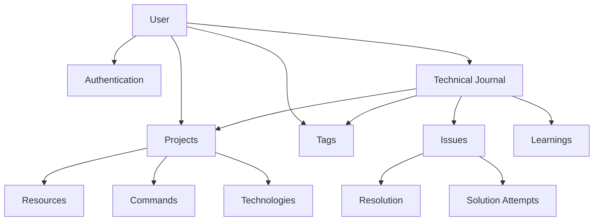

---

# 2. Actors

No MVP existe apenas um ator:

```text
User
```

O sistema é pessoal, mas ainda terá autenticação para permitir o estudo de:

- cookies HttpOnly;
- autorização;
- isolamento de dados;
- JWT ou sessão;
- guards;
- testes de autenticação.

Cada recurso pertence a um usuário.

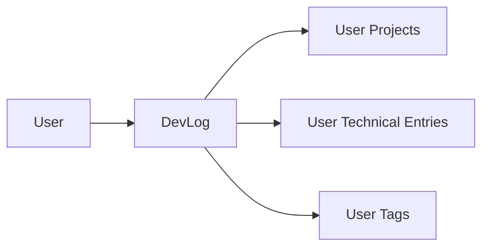

Um usuário nunca pode acessar recursos pertencentes a outro usuário.

---

# 3. Authentication

Casos de uso relacionados à conta e autenticação.

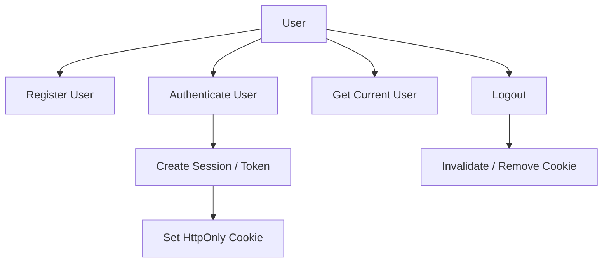

## RegisterUser

Cria uma nova conta.

### Input

```text
name
email
password
```

### Regras

- email deve ser válido;
- email não pode estar cadastrado;
- senha deve respeitar os critérios mínimos;
- senha nunca é armazenada diretamente;
- senha deve ser convertida para hash.

### Output

```text
User
```

---

## AuthenticateUser

Autentica um usuário.

### Input

```text
email
password
```

### Fluxo

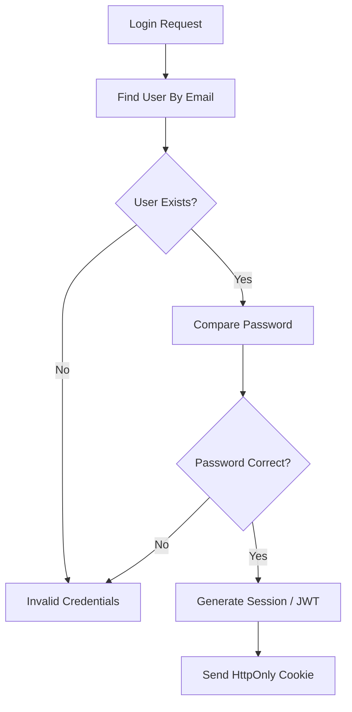

---

## GetCurrentUser

Retorna os dados do usuário autenticado.

Exemplo:

```text
GET /users/me
```

---

## LogoutUser

Encerra a autenticação atual.

Dependendo da estratégia escolhida:

```text
JWT simples:
    remove cookie

Refresh/session:
    invalida sessão
    remove cookie
```

---

# 4. Projects

O projeto fornece contexto para os registros técnicos.

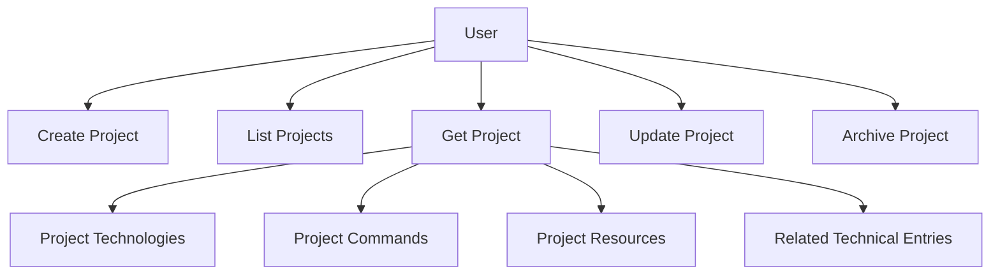

---

## CreateProject

Cria um projeto.

### Input

```text
name
description?
repositoryUrl?
localPath?
status?
```

### Regras

- projeto pertence ao usuário autenticado;
- nome é obrigatório;
- repositoryUrl, se informado, deve ser uma URL válida.

---

## UpdateProject

Atualiza informações gerais do projeto.

Exemplos:

```text
nome
descrição
repositório
caminho local
status
```

### Regra principal

Somente o proprietário pode alterar o projeto.

O update é parcial: propriedades ausentes permanecem inalteradas. Para os
campos opcionais `description` e `localPath`, o valor `null` remove o conteúdo
existente. Uma requisição sem nenhum campo editável é inválida.

---

## GetProject

Retorna um projeto específico.

O resultado futuramente pode agregar:

```text
Project

Technologies
Commands
Resources
Technical Entries
```

---

## ListProjects

Lista projetos do usuário.

Filtros possíveis:

```text
status
archived
name
technology
```

No MVP não é necessário implementar todos.

Inicialmente:

```text
name
status
```

já são suficientes.

---

## ArchiveProject

Arquiva um projeto.

Não é necessário excluir fisicamente o registro.

```text
ACTIVE
    ↓
ARCHIVED
```

Registros técnicos existentes continuam relacionados ao projeto.

O arquivamento e a restauração são comandos explícitos e idempotentes:

```text
ArchiveProject -> preenche archivedAt
RestoreProject -> remove archivedAt
```

---

# 5. Project Technologies

Representam tecnologias utilizadas em um projeto.

Exemplo:

```text
DevLog

NestJS
PostgreSQL
Prisma
React
Docker
```

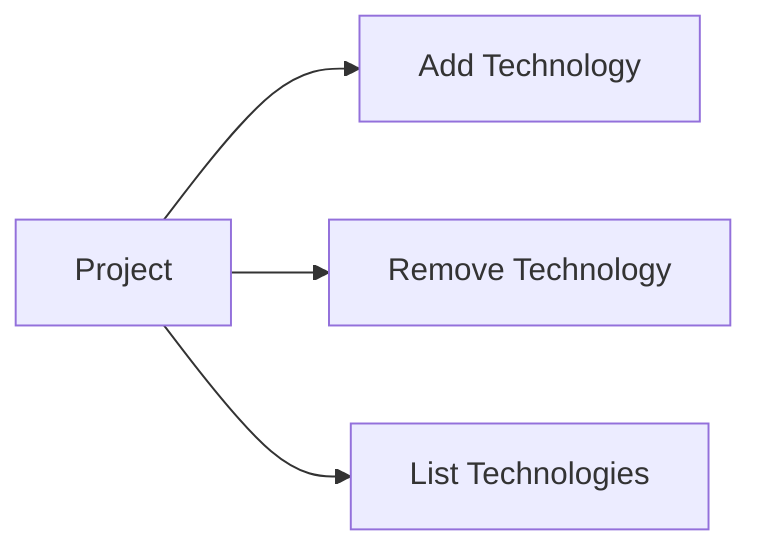

---

## AddProjectTechnology

### Input

```text
projectId
name
version?
```

Exemplo:

```text
NestJS
11
```

### Regras

- projeto precisa pertencer ao usuário;
- não adicionar a mesma tecnologia duas vezes ao projeto.

---

## RemoveProjectTechnology

Remove uma tecnologia do projeto.

Isso não remove registros técnicos que utilizem uma tag com o mesmo nome.

Tecnologia de projeto e tag são conceitos diferentes.

---

# 6. Project Commands

Permite documentar como trabalhar com determinado projeto.

Exemplo:

```text
Start development

pnpm dev
```

Outro:

```text
Run migrations

pnpm --filter api exec prisma migrate dev
```

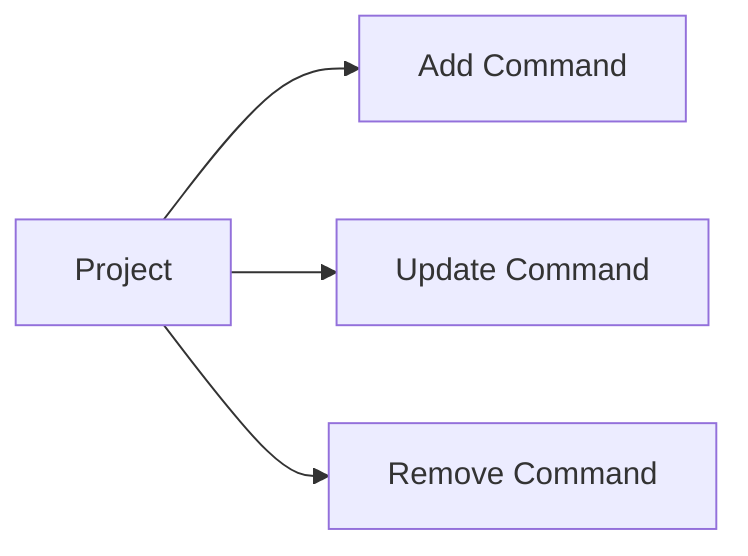

---

## AddProjectCommand

### Input

```text
projectId
title
command
description?
```

Exemplo:

```text
title:
Start API

command:
pnpm --filter api dev
```

---

# 7. Project Resources

Links relacionados ao projeto.

Exemplos:

```text
GitHub Repository
Swagger
Documentation
Figma
Production URL
Staging URL
```

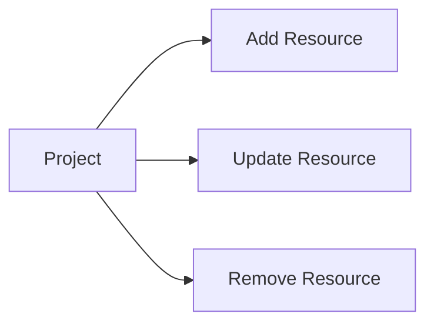

### Estrutura

```text
label
url
type?
```

---

# 8. Technical Entries

Esta é a funcionalidade principal do DevLog.

Um registro representa algo aprendido ou um problema encontrado.

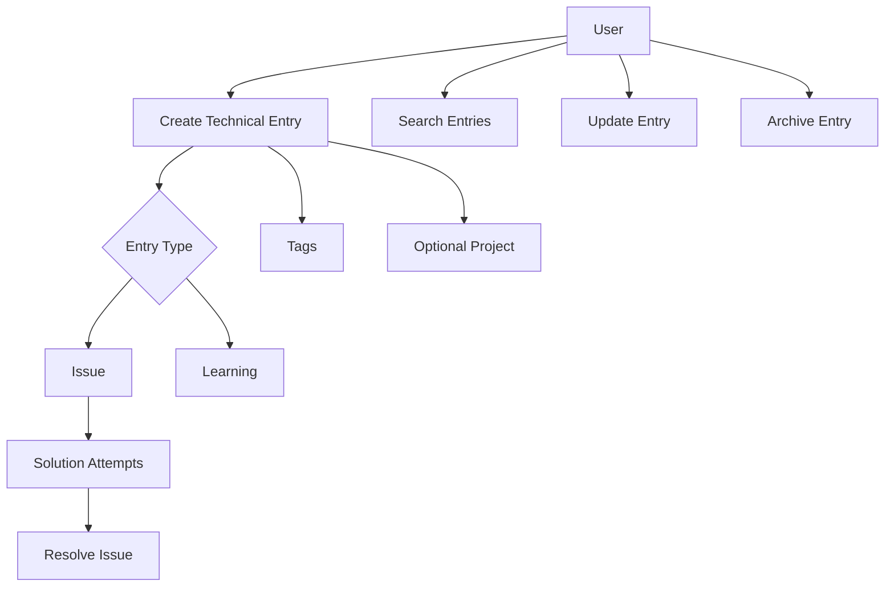

---

# 9. CreateTechnicalEntry

Cria um registro no diário.

### Input

```text
title
type
context
conclusion?
projectId?
tags?
```

Inicialmente existem dois tipos:

```text
ISSUE
LEARNING
```

---

## ISSUE

Representa um problema encontrado.

Exemplo:

```text
Title:
Cookie not being sent to the API

Context:
React running on :5173 and NestJS on :3000.

Problem:
Authentication cookie was not included in requests.
```

Pode possuir:

```text
SolutionAttempts[]
```

E eventualmente:

```text
resolution
resolvedAt
```

---

## LEARNING

Representa algo aprendido que não necessariamente veio de um erro.

Exemplo:

```text
Title:
Prisma migrate dev does not generate the client in Prisma 7

Context:
After applying a migration the generated client was outdated.

Conclusion:
Run prisma generate explicitly.
```

Não precisa possuir tentativas de solução.

---

# 10. UpdateTechnicalEntry

Permite alterar o conteúdo do registro.

Pode alterar:

```text
title
context
conclusion
project
tags
```

### Restrições

O tipo do registro não deveria ser alterado livremente após ele começar a possuir comportamento específico.

Exemplo:

```text
ISSUE com SolutionAttempts
```

não deveria simplesmente virar:

```text
LEARNING
```

sem tratamento explícito.

Para o MVP, pode ser mais simples impedir a alteração do `type` após criação.

Uma entrada com `resolvedAt` preenchido deve sempre manter uma conclusão não
vazia. Por isso, o update comum não pode remover a conclusão de uma entrada
resolvida; a transição de estado continua pertencendo a `ResolveTechnicalIssue`
e `ReopenTechnicalIssue`.

---

# 11. GetTechnicalEntry

Retorna o registro completo.

Exemplo:

```text
Technical Entry

Title
Type
Context
Conclusion
Project
Tags

if ISSUE:
    Solution Attempts
    Status
```

---

# 12. ListTechnicalEntries

Essa será provavelmente a consulta mais utilizada da aplicação.

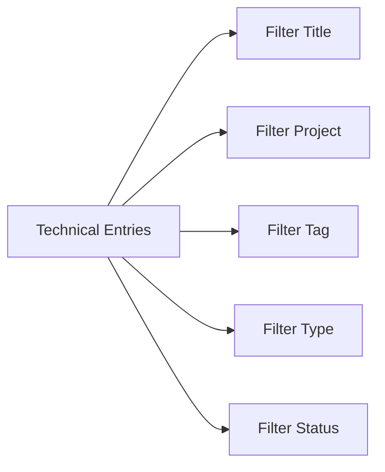

Filtros possíveis:

```text
title
projectId
tagId
type
status
```

O filtro `title` procura correspondências parciais sem diferenciar letras maiúsculas e minúsculas.

Exemplo:

```text
title = cookie
projectId = 5ab0c050-5050-4d2b-b0a0-44247985de2b
tagId = 6bc1d161-6161-4e3c-a1b1-55358096ef3c
type = ISSUE
status = RESOLVED
```

---

# 13. Solution Attempts

Existem apenas para registros do tipo `ISSUE`.

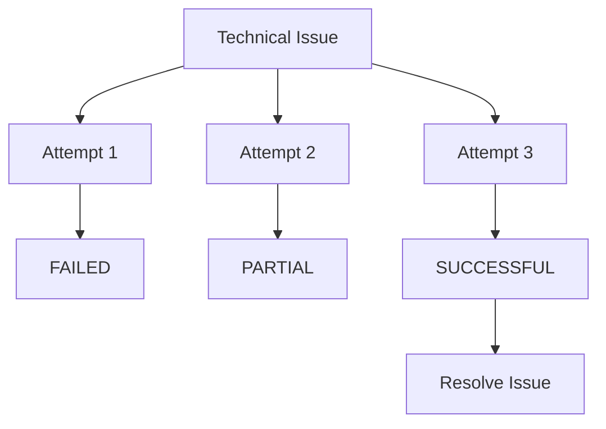

---

## AddSolutionAttempt

Registra uma tentativa realizada para resolver um problema.

### Input

```text
entryId
description
result
```

Resultado:

```text
FAILED
PARTIAL
SUCCESSFUL
```

### Regras

- registro precisa pertencer ao usuário;
- registro precisa ser `ISSUE`;
- registros do tipo `LEARNING` não possuem tentativas;
- problema arquivado não deveria receber novas tentativas.

---

# 14. ResolveTechnicalIssue

Marca um problema como resolvido.

```text
OPEN
 ↓
RESOLVED
```

### Input

```text
entryId
conclusion
```

Pode existir uma tentativa bem-sucedida relacionada, mas isso não precisa ser obrigatório.

Exemplo:

```text
Conclusion:

The API was correctly configured.
The actual issue was that fetch did not use credentials: include.
```

### Regras

- apenas `ISSUE` pode ser resolvido;
- conclusão é obrigatória;
- registra `resolvedAt`.

---

# 15. ReopenTechnicalIssue

Permite reabrir um problema.

```text
RESOLVED
   ↓
OPEN
```

O histórico de tentativas e a solução anterior continuam registrados.

Isso é importante porque um problema pode parecer resolvido e posteriormente reaparecer.

---

# 16. Tags

Tags classificam conhecimento.

Exemplos:

```text
NestJS
Docker
React
Prisma
PostgreSQL
Cookies
Authentication
DDD
Testing
```

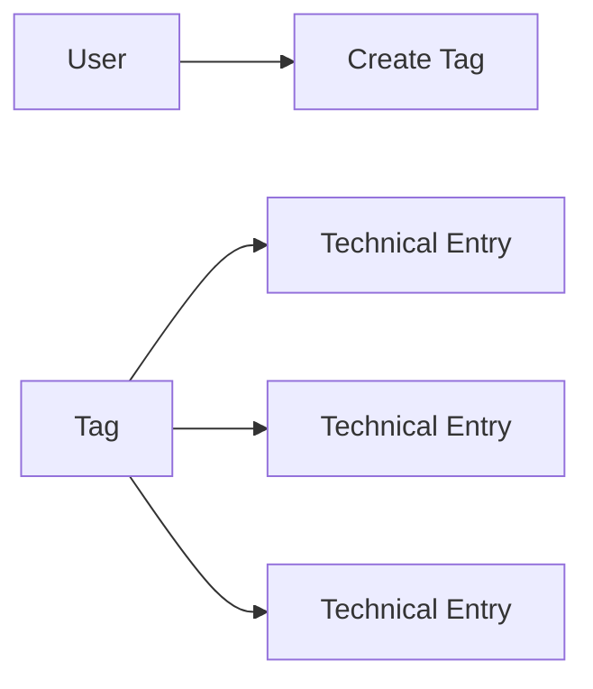

Uma entrada pode possuir várias tags:

```text
Cookie not being sent

Tags:
- NestJS
- React
- Authentication
- Cookies
```

---

## CreateTag

### Input

```text
name
```

### Regras

- pertence ao usuário;
- não permitir duas tags com o mesmo nome para o mesmo usuário.

---

## AddTagToTechnicalEntry

Relaciona uma tag existente a um registro.

### Regra

Tanto a tag quanto o registro precisam pertencer ao usuário autenticado.

---

## RemoveTagFromTechnicalEntry

Remove apenas a relação.

Não remove a tag.

---

# 17. Relação Project × Technical Entry

Essa relação é importante para o conceito do DevLog.

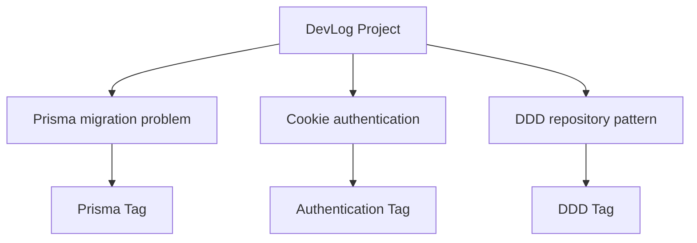

Projeto representa:

```text
Onde isso aconteceu?
```

Tag representa:

```text
Sobre o que isso é?
```

Exemplo:

```text
Technical Entry:
Cookie HttpOnly not being sent

Project:
DevLog

Tags:
NestJS
React
Cookies
Authentication
```

---

# 18. Fluxo principal do usuário

Um fluxo esperado de uso seria:

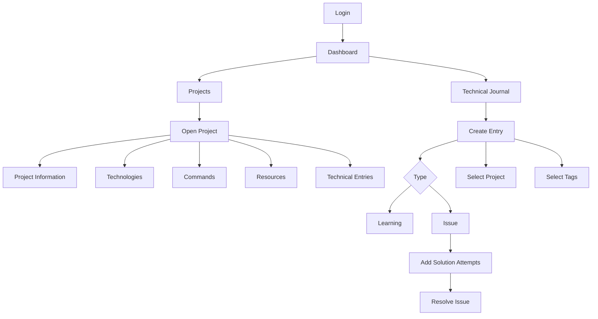

---

# 19. Casos de uso do MVP

## Authentication

```text
RegisterUser
AuthenticateUser
GetCurrentUser
LogoutUser
```

## Projects

```text
CreateProject
UpdateProject
GetProject
ListProjects
ArchiveProject
```

## Project Technologies

```text
AddProjectTechnology
RemoveProjectTechnology
```

## Project Commands

```text
AddProjectCommand
UpdateProjectCommand
RemoveProjectCommand
```

## Project Resources

```text
AddProjectResource
UpdateProjectResource
RemoveProjectResource
```

## Technical Entries

```text
CreateTechnicalEntry
UpdateTechnicalEntry
GetTechnicalEntry
ListTechnicalEntries
ArchiveTechnicalEntry
```

## Issues

```text
AddSolutionAttempt
ResolveTechnicalIssue
ReopenTechnicalIssue
```

## Tags

```text
CreateTag
ListTags
AddTagToTechnicalEntry
RemoveTagFromTechnicalEntry
```

---

# 20. Representação da camada Application

Isso pode se refletir diretamente na estrutura do NestJS.

```text
src/
└── modules/
    ├── users/
    │   └── application/
    │       └── use-cases/
    │           ├── register-user.use-case.ts
    │           └── get-current-user.use-case.ts
    │
    ├── auth/
    │   └── application/
    │       └── use-cases/
    │           ├── authenticate-user.use-case.ts
    │           └── logout-user.use-case.ts
    │
    ├── projects/
    │   └── application/
    │       └── use-cases/
    │           ├── create-project.use-case.ts
    │           ├── update-project.use-case.ts
    │           ├── get-project.use-case.ts
    │           ├── list-projects.use-case.ts
    │           ├── archive-project.use-case.ts
    │           ├── add-project-technology.use-case.ts
    │           ├── add-project-command.use-case.ts
    │           └── add-project-resource.use-case.ts
    │
    ├── technical-entries/
    │   └── application/
    │       └── use-cases/
    │           ├── create-technical-entry.use-case.ts
    │           ├── update-technical-entry.use-case.ts
    │           ├── get-technical-entry.use-case.ts
    │           ├── list-technical-entries.use-case.ts
    │           ├── archive-technical-entry.use-case.ts
    │           ├── add-solution-attempt.use-case.ts
    │           ├── resolve-technical-issue.use-case.ts
    │           └── reopen-technical-issue.use-case.ts
    │
    └── tags/
        └── application/
            └── use-cases/
                ├── create-tag.use-case.ts
                ├── list-tags.use-case.ts
                ├── add-tag-to-entry.use-case.ts
                └── remove-tag-from-entry.use-case.ts
```

---

# 21. Ordem sugerida de implementação

Não é necessário implementar todos os casos de uso de uma vez.

Uma ordem que permite estudar as camadas gradualmente é:

```text
1. Shared/domain base

2. Users
   └── RegisterUser

3. Authentication
   ├── AuthenticateUser
   ├── GetCurrentUser
   └── LogoutUser

4. Technical Entries
   ├── CreateTechnicalEntry
   ├── GetTechnicalEntry
   ├── ListTechnicalEntries
   └── UpdateTechnicalEntry

5. Tags
   ├── CreateTag
   ├── ListTags
   └── relacionar tags com entries

6. Projects
   ├── CreateProject
   ├── GetProject
   ├── ListProjects
   └── UpdateProject

7. Relacionar
   TechnicalEntry -> Project

8. Issues
   ├── AddSolutionAttempt
   ├── ResolveTechnicalIssue
   └── ReopenTechnicalIssue

9. Project details
   ├── Technologies
   ├── Commands
   └── Resources

10. Archive
    ├── ArchiveProject
    └── ArchiveTechnicalEntry
```

---

# 22. MVP essencial vs completo

Nem todos os casos de uso precisam existir para começar a utilizar o DevLog.

## Primeiro MVP utilizável

```text
RegisterUser
AuthenticateUser

CreateTechnicalEntry
UpdateTechnicalEntry
GetTechnicalEntry
ListTechnicalEntries

CreateTag
ListTags

CreateProject
GetProject
ListProjects
```

Com isso já é possível:

```text
Criar projeto
    ↓
Criar registro técnico
    ↓
Relacionar registro ao projeto
    ↓
Adicionar tags
    ↓
Pesquisar posteriormente
```

Depois:

```text
Solution Attempts
Project Commands
Technologies
Resources
Archive
```

podem ser adicionados incrementalmente.

---

# 23. Regra conceitual principal

O DevLog deve responder principalmente três perguntas:

```text
O que eu aprendi?
    → TechnicalEntry

Onde eu aprendi/encontrei isso?
    → Project

Sobre qual assunto?
    → Tag
```

Para problemas existe uma quarta pergunta:

```text
Como eu resolvi?
    → SolutionAttempt + Resolution
```

Essa é a base funcional do MVP.
